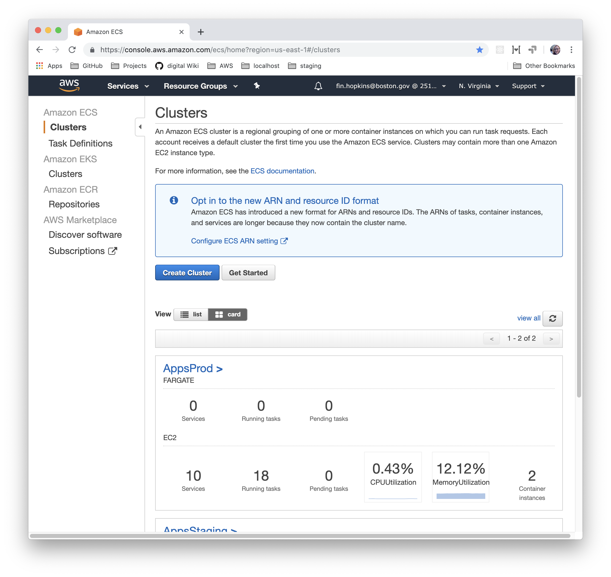
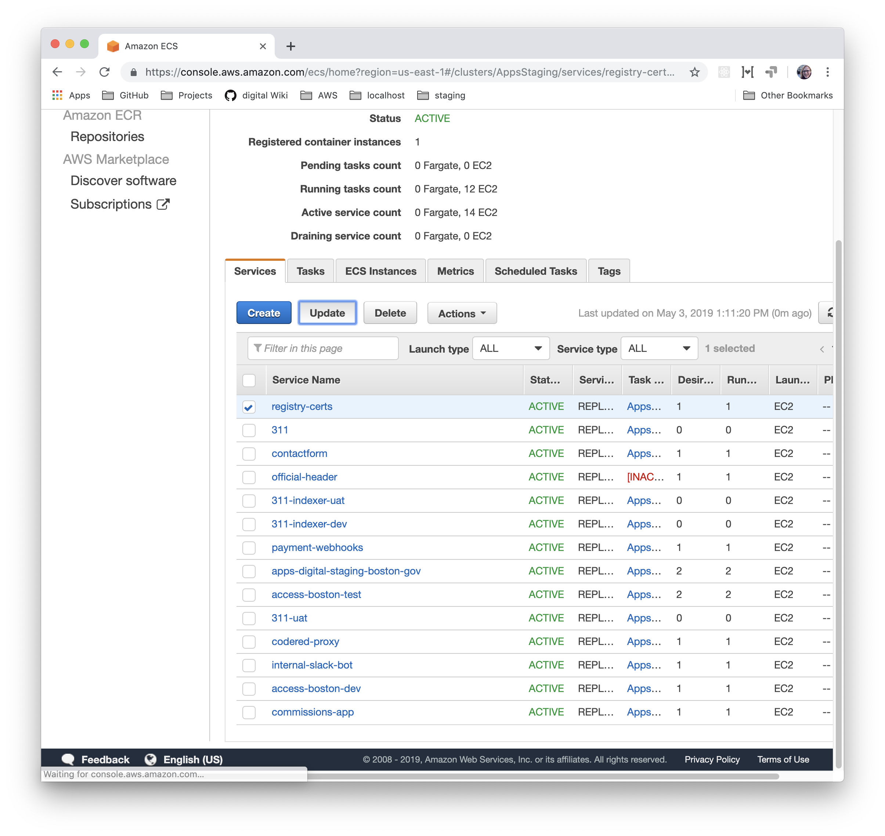
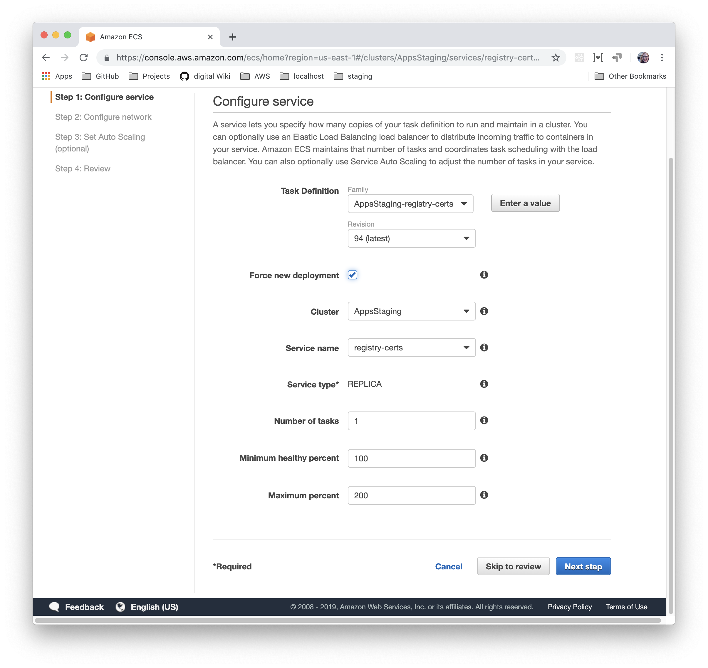
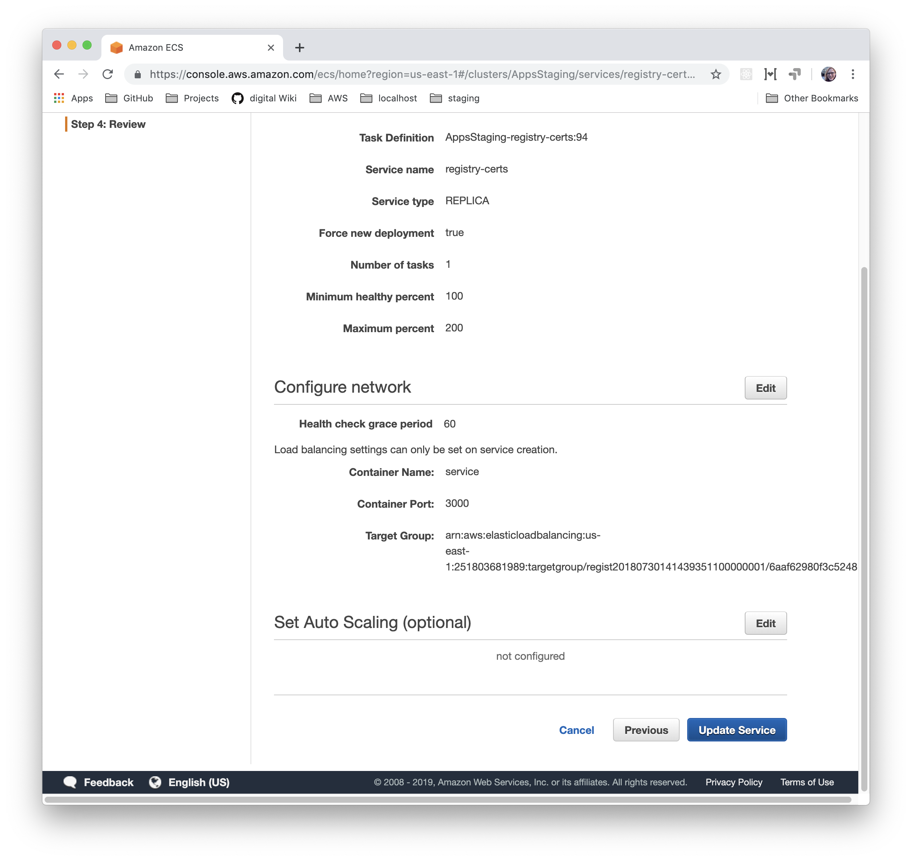
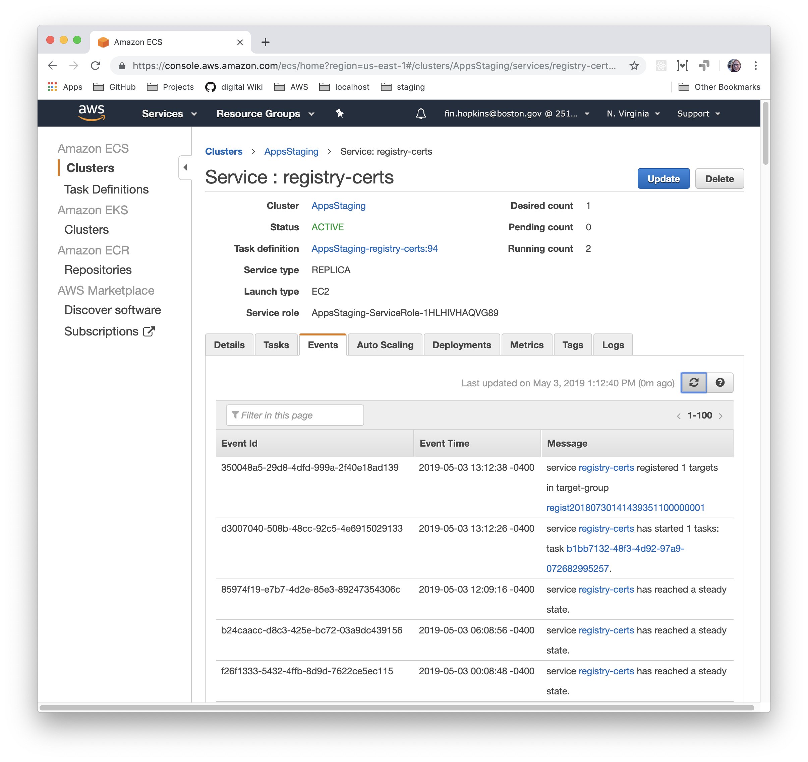

# Restarting an ECS service

When you update a service’s configuration in S3 you’ll need to manually restart it to pick up the file changes. Because we do rolling ECS updates, you can do this without dropping traffic.

## Prerequisites

You will need to have an AWS Console account.

## Steps

First, visit the ECS page on AWS and choose your cluster \(AppsStaging or AppsProd\).

Then, click the checkbox next to the service you want to restart and press the **Update** button.

Don’t touch any other settings, but make sure to click the **Force new deployment** checkbox. That will start up new containers, even though the code hasn’t changed from what’s currently running.

Click **Next step** through all of the screens, and then click **Update service**.

Navigate to the service’s “Events” tab and keep an eye on things. You should see it start new tasks and eventually deregister and stop the old tasks. Once it says “…has reached a steady state” again then you know things were successful.

