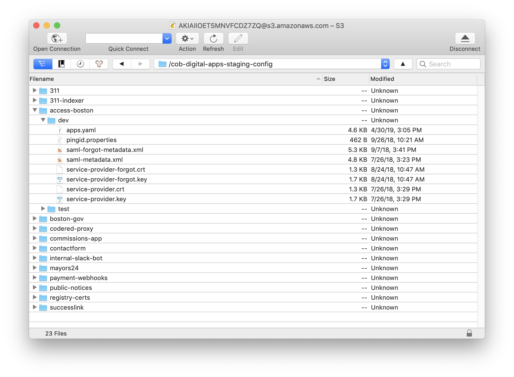

# Service Configuration

Services typically need runtime configuration that doesn’t get checked in to GitHub. This can range from environment-specific values (like URLs or API keys) to actual secrets (passwords).

We configure our container-based services using S3. We store files in special S3 buckets and directories, and when the containers start up they copy those files into themselves. We consistently use `dotenv` (both for [Node](https://www.npmjs.com/package/dotenv) and [Ruby](https://rubygems.org/gems/dotenv)) so we can use `.env` files to set environment variables our apps will see.

### Guides

* [Editing a project’s configuration using Cyberduck](editing-a-projects-.env-using-cyberduck.md)
* [Encrypting service configuration variables](encrypting-service-configuration.md)

## How it’s set up

The two buckets are called `cob-digital-apps-staging-config` and `cob-digital-apps-prod-config`. Within each are sub-directories for each of our services. Those sub-directories match the ECS service names.

The service directories can contain config files directly, and they can also have sub-directories with variant-specific configuration. We use variants in our staging environment to handle cases where we need to have different configurations. For example, Access Boston has “dev” and “test” variants that correspond to separate integration environments.

The buckets are configured to keep old versions of files, so we can recover from changes if we need to.

### Configuration during service start-up

Our container-based apps in the [CityOfBoston/digital monorepo](https://github.com/CityOfBoston/digital) have an [`ENTRYPOINT` script](https://github.com/CityOfBoston/digital/blob/develop/scripts/service-entrypoint.sh) that syncs in the contents of the appropriate S3 directories before running the server start command.

The script first syncs the service’s main directory (either staging or prod, whichever is appropriate). It then syncs the variant-specific directory, or `default` if the container is running as the unnamed default variant.

In this way, you can override the configuration for a variant on a file-by-file basis.

### Encrypted values

Some values, like database passwords or OAuth secrets, should not be stored in plaintext on disk. Each container-based service automatically gets a KMS keypair that only it has permission to decrypt with.

Our Node-based apps use the [`srv-decrypt-env` module](https://github.com/CityOfBoston/digital/tree/develop/modules-js/srv-decrypt-env) to automatically decrypt any environment variables that end in the `_KMS_ENCRYPTED` suffix at runtime. (We do not have a similar library for Ruby, so we don’t encrypt those passwords for our few Ruby apps.)

See the [Encrypting service configuration for S3 guide](encrypting-service-configuration.md) for how to generate the encrypted values.
