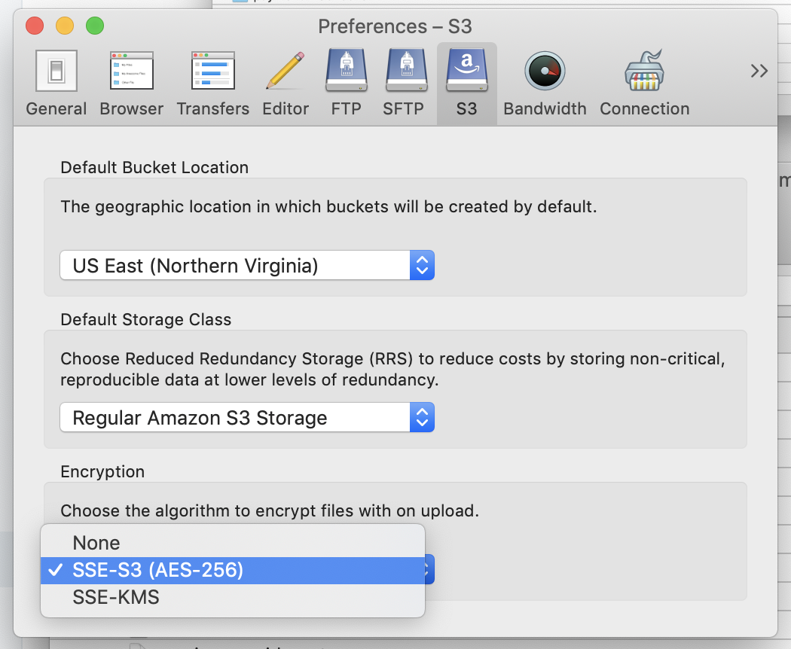
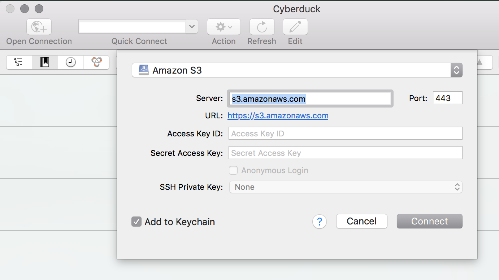
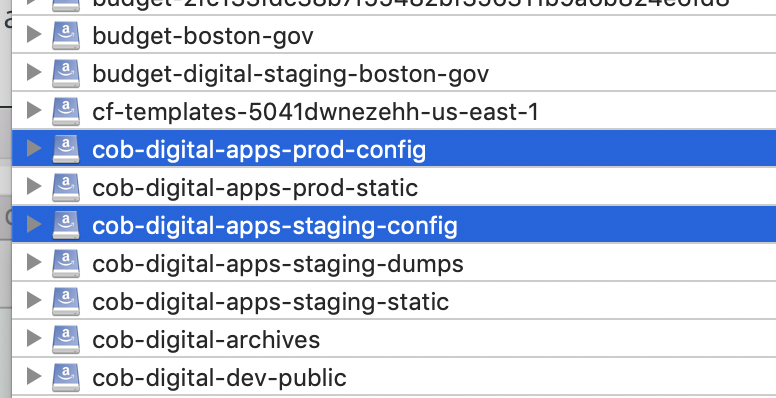
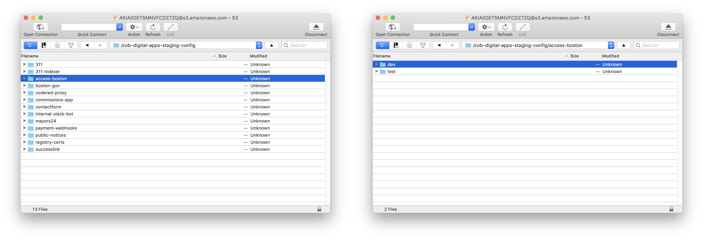
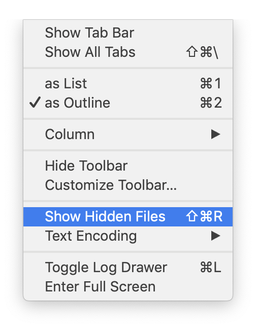
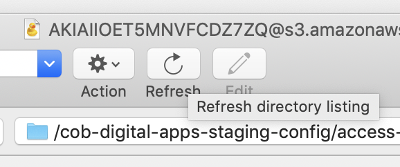
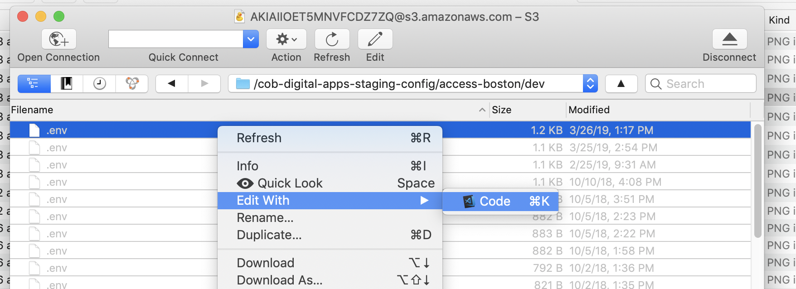

# Editing a project’s configuration using Cyberduck

## Prerequisites

* [Cyberduck](https://cyberduck.io/)
* AWS CLI access key

## Setup

In Cyberduck’s preferences, you’ll need to enable encryption for communicating with S3. Choose “SSE-S3 \(AES-256\)” from the “Encryption” dropdown in the S3 section.

## Steps

1. Open Cyberduck, and click the “Open Connection” button.

2. Select “Amazon S3” in the dropdown, and then enter your AWS CLI **Access Key ID** and **Secret Access Key**.


The AWS access key/secret pair is **not** the same thing as the credentials you use to log into AWS via web browser.


3. Double-click on either `cob-digital-apps-prod-config` or `cob-digital-apps-staging-config`, depending on whether you want to edit prod or staging. 

4. Double click on the service whose configuration you’d like to change. Some staging services have “variants” \(for example, Access Boston has both “dev” and “test” configurations to match the IAM team’s integration environments\). Click into a variant if appropriate.

5. Choose “Show Hidden Files” from the “View” menu so that files starting with a `.` \(such as `.env`\) are visible. Note that this will also show previous versions of files.  

6. **Press the Refresh button.** This is incredibly important. Otherwise you may end up editing an older version of a file and overwrite newer changes.

7. Right-click on the most recent version of `.env` and edit it. When you save in your editor, Cyberduck will update the S3 bucket automatically.


If you’re adding a secret to the config file, see the [Encrypting service configuration for S3](encrypting-service-configuration.md) guide.



Don’t forget to always press Refresh before editing! If you mess up and forget, you can usually go back and edit a previous version and re-save it to make it the most recent version, then re-apply your changes.


8. Once you’ve updated the configuration, you’ll need to restart the ECS tasks for the service, since they only get the latest configuration on startup. See the [Restarting an ECS service guide](restarting-an-ecs-service.md).

