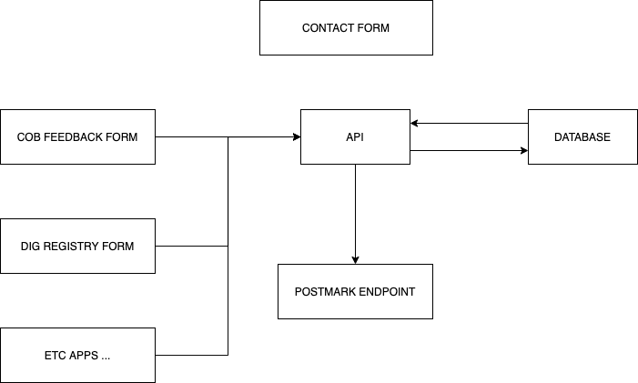

# Ruby

Contact Form

This application receives the content and headers from our contact form \(email\) [component](https://patterns.boston.gov/components/detail/contact_form.html), stores the data and queues it for delivery to our mail client \([postmark](https://postmarkapp.com/developer)\). This app is hosted on our AWS as an ECS container along with other Services-JS apps. Every instance where the contact form is used corresponds to an entry in a database that issues an application token and stores where each form should send the email too. 

When a contact form is submitted it sends the form data and the application token to a NodeJS service on AWS. This service stores the form data in a database, this data waits for a recurring process that will send the latest entry in the DB to our mail service \(Postmark\) that will queue and send each email to their corresponding recipient.

