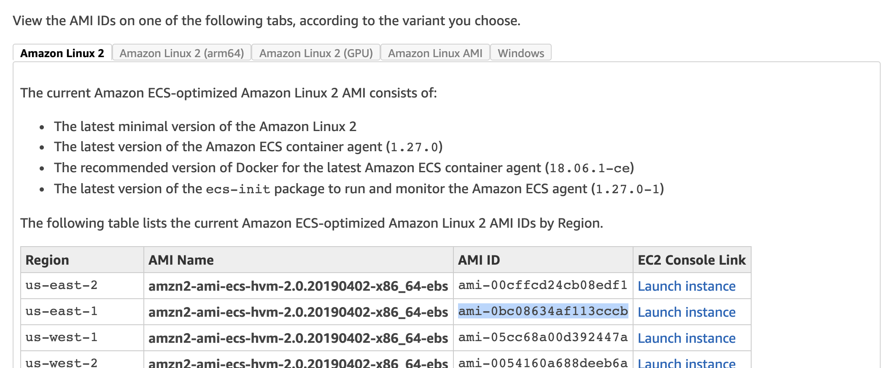

# Updating the ECS cluster

The Digital webapps cluster uses the Elastic Container Service on AWS. We have a handful of EC2 instances that actually run the containers.

These instances use a stock Amazon Machine Image \(AMI\) from Amazon designed for Docker that comes with the ECS agent pre-installed. From time to time, Amazon releases a new version of this “ECS-optimized” image, either to upgrade the ECS agent or the underlying OS.

You’ll know there’s a new version of the AMI because we’ve subscribed the digital-dev@boston.gov email address up to Amazon’s notification queue for updates. There will also be a yellow notice box on the ECS interface in the AWS web console.

## Running the update

Thanks to our [instance-drain Lambda function](https://github.com/CityOfBoston/digital-lambda/tree/production/instance-drain), updating the cluster images is a zero-downtime process. Nevertheless, it’s best to run this during the weekly digital maintenance window, and make sure that staging looks good before doing it on production.

This process is sometimes referred to as “rolling” the cluster though it’s more accurate that we set up a second cluster of machines and migrate to it.

1. Find the latest ID for the ECS-optimized AMI. You can do this on the [Amazon ECS-optimized AMIs page](https://docs.aws.amazon.com/AmazonECS/latest/developerguide/ecs-optimized_AMI.html). Make sure you’re looking under the “Amazon Linux 2” tab and pick the one for `us-east-1`.

2. Make a PR in [CityOfBoston/digital-terraform](https://github.com/CityOfBoston/digital-terraform/) that updates the `instance_image_id` value for the `staging_cluster` module in [`clusters.tf`](https://github.com/CityOfBoston/digital-terraform/blob/production/apps/clusters.tf) to the new value you found.

3. Get the PR approved and comment `atlantis apply` to have Atlantis run the update. \(See [Making changes with Terraform](making-changes-with-terraform.md) for more details.\)

4. Terraform will create a new Launch Configuration for staging cluster instances that uses the new AMI, and a new Autoscaling Group that uses it. It will then trigger deletion of the old Autoscaling Group.

5. The instance-drain Lambda function will tell ECS to drain the tasks from the instances that are being shut down \(Terraform won’t delete the Autoscaling Group until its instances are fully terminated\). ECS will automatically start those tasks up on the new instances that got created by the new Autoscaling Group.

6. Keep an eye on the “ECS Instances” tab in the cluster’s UI. You should see the “Running tasks” on the draining instance\(s\) go down, and go up on the new instances.

7. Once all the tasks have moved, the old instance\(s\) will terminate and Terraform will complete. Check a few URLs on staging to make sure that everything’s up-and-running.

8. Now that Atlantis’s apply finished, you can merge the staging PR and repeat the process for production.

After the production instances are fully up, check that they have roughly equal “Running tasks” numbers. ECS should schedule duplicate tasks on separate machines so that they are split across AZs. If you see a service has both of its tasks on the same instance you can run a force deployment to restart it. \(See [Restarting an ECS service](service-configuration/restarting-an-ecs-service.md)\)

