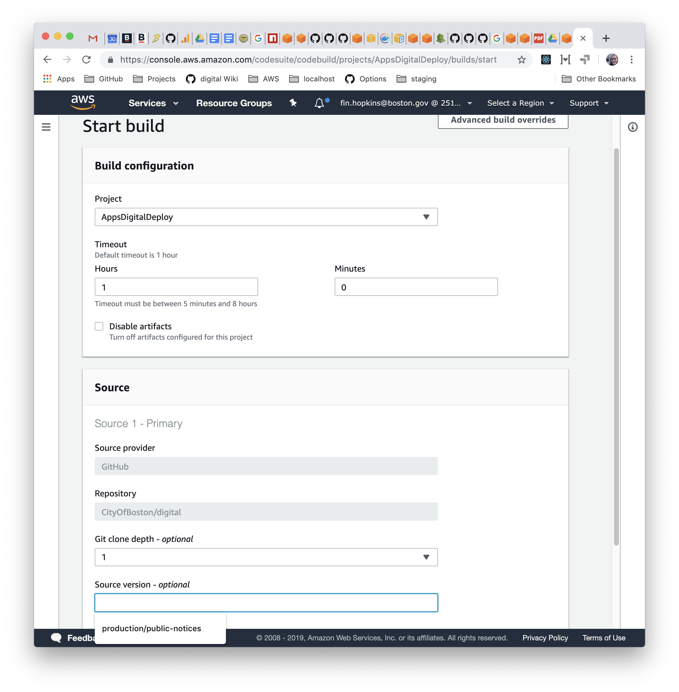
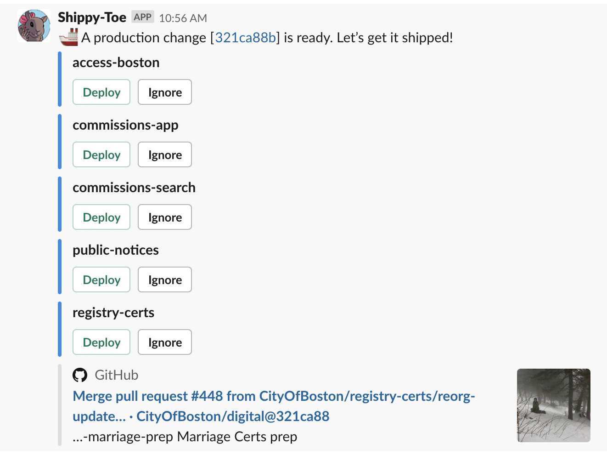

# Webapp Deployment

## How to Deploy

### Staging

1. Commit your changes locally
2. Run `git push --force --no-verify origin HEAD:staging/service-name` or `git push --force --no-verify origin HEAD:staging/service-name@variant` to get the changes on GitHub 
3. Click “Deploy” when prompted by Shippy-Toe in the `#digital_builds` channel

### Production

1. Get your PR reviewed and merge it to `develop` \(see: [Git / GitHub](../../standards-and-best-practices/git-and-github/)\)
2. Travis will do a full test run which, if it succeeds, will notify Shippy-Toe
3. Click “Deploy” when prompted by Shippy-Toe in the `#digital_builds` channel


It’s recommended that engineers turn Slack notifications on for all messages in `#digital_builds`, since both deployment prompts and Travis success / failure messages go there.



If `internal-slack-bot` comes up in the list of things to deploy, deploy it last, after the others have all succeeded. Otherwise it will lose state about what remains to deploy.


### Manually

Our staging and production deploys are done through our `AppsDigitalDeploy` Amazon CodeBuild project.

If you need to manually re-try a build, or if Slack or just `internal-slack-bot` is down, you can deploy by using CodeBuild directly:

1. In the AWS CodeBuild console, choose “AppsDigitalDeploy”
2. Click the “Start build” button
3. In the “Source” section of the dialog that comes up, enter the branch name under “Source version.” This will be either `staging/service-name[@variant]` or `production/service-name`
4. Click “Start build” at the bottom of the dialog

## Design and Implementation

Our goals for a deployment mechanism are to let us quickly, easily, safely, and securely ship new and updated code to our customers.

To this end, we have a system that gives us the following things:

* Code can be deployed with one click, which is both easy and keeps us from making mistakes
* Old versions of services are only turned down when the new versions are healthy, so we don’t have downtime
* Production code has to pass unit tests before it can be released
* Staging can be pushed to on-demand for testing / demoing in a production-like environment
* New, isolated staging environments can be created by editing a few variables in our Terraform configuration
* Releasing code requires both GitHub and Slack access, limiting the window of unauthorized pushes
* We’re signaled when there’s undeployed code on `develop` for our services, so production doesn’t stay diverged from the checked-in code

### Environments

#### Staging

* Does not require a code review or tests to pass to deploy
* Hosted at _service-name._digital-staging.boston.gov for container-based apps, apps.digital-staging.boston.gov/_service-name_ for S3-based apps
* Supports “variants” that allow for separate code and/or configuration
* Currently a cluster of one machine, since all our apps fit there

Run `git push --force --no-verify origin HEAD:staging/service-name[@variant]` to trigger staging deployment.

The DNS for staging is taken care of by a wildcard `*.digital-staging.boston.gov` CNAME that points to our ALB, so there’s no per-service configuration that needs to happen outside of our team.

#### Production

* Triggered when changes to a service are merged via PR into `develop` and pass tests on Travis
* Hosted at _subdomain._boston.gov or apps.boston.gov/_subpath_ depending on configuration
* Does not support variants
* Containers are replicated across 2 AZs for resilience

New `boston.gov` subdomains need to be manually added by the network team. See [New service setup](new-service-setup.md).

### Types of Deployment

#### Docker Containers

For webapps that need a server implementation, usually in Node but Ruby for some legacy applications, we deploy in a Docker container to our Elastic Container Service cluster in AWS.

Docker containers let us trivially deploy many isolated apps on to a few machines, keeping our costs low, and ECS’s integration with Amazon’s Application Load Balancers gives us automatic health checking and zero-downtime deploys.

#### Static S3 Sites

Some of our sites are just static HTML, or are static HTML and static JavaScript. The `public-notices` app is an example of this.

These apps are served from the `cob-digital-apps-prod-static` S3 bucket by an nginx server running in a container in the ECS cluster. This is set up by the [`proxy_pass_service`](https://github.com/CityOfBoston/digital-terraform/blob/production/apps/modules/proxy_pass_service/main.tf) module in digital-terraform.

### Shippy-Toe

All of the webapp deployments through the monorepo use our [`internal-slack-bot`](https://github.com/CityOfBoston/digital/tree/develop/services-js/internal-slack-bot) service, which appears as [Shippy-Toe](https://en.wikipedia.org/wiki/Squirrel_Girl#Tippy-Toe) the [squirrel](https://www.quora.com/On-GitHub-what-is-the-significance-of-the-Ship-It-squirrel) in the `#digital_builds` channel.

Deployable changes to staging branches or the `develop` branch will trigger prompts in `#digital_builds`. Just press the “Deploy” button to release them.

