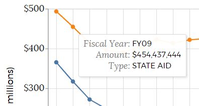

# Charts on boston.gov

We use the [VegaLite](https://vega.github.io/vega-lite/) and [Vega](https://vega.github.io/vega/) libraries to create our charts on boston.gov. VegaLite is an easier to use version of Vega. Both libraries are built on top of [D3](https://d3js.org/). It does a little more guess work for us so we don't have to be so specific in defining our charts. These libraries let users define/create a chart using a JSON schema. 

From a technical standpoint, we wrap this library up as a web component that is stored in [Fleet](../projects/fleet-pattern-library.md), our patterns library. The `<cob-chart>` component takes a JSON object as input in a Vega or VegaLite schema as input and creates a chart. 

From a functional standpoint, when putting charts on boston.gov, we place them within text components in an effort to bring context to the data and information the chart is displaying. The [FY20 Budget Website](https://www.boston.gov/departments/budget/fy20-budget) has good examples of how charts should be used with narrative explanation. 

#### Good Reads

* [How Vega works Observable Notebook](https://observablehq.com/@vega/how-vega-works)
* [An introduction to VegaLite Observable Notebook](https://observablehq.com/@uwdata/introduction-to-vega-lite)
* [Guide to Axes & Legends in Vega](https://observablehq.com/@vega/a-guide-to-guides-axes-legends-in-vega)

## Putting a chart on boston.gov

In general, content on boston.gov should be at or below an 8th grade reading level. In an attempt to be in accordance with this and keep our site as easy-to-understand as possible, we push for simple and straight forward charts \(e.g. bar charts, line charts, and sometimes pie charts if we have to\). 

Coordination with both the boston.gov Content Manager \(for chart placement\) and the Analytics Team \(for chart data\) will be required to get a chart on boston.gov. 

The general overview for getting a chart on boston.gov is:

1. Get some data
2. Work with the Analytics Team to get it into a public s3 bucket and set up an automated workflow for it getting updated \(if appropriate\).
3. Grab the schema from one of the charts below that looks/is most like the one you want to build
4. Drop it into the [Online Vega Editor](https://vega.github.io/editor/#/edited) to start editing it to use your data 
5. Check that your chart works/looks okay using the [COB-chart editor](https://patterns.boston.gov/web-components/chart-editor.html).
6. Add your chart to boston.gov through Drupal. 

### Getting the data with the Analytics Team

Vega/VegaLite can read in data from a publicly available url. We leverage this functionality so that we can set up separate automation practices for the data charts on boston.gov display. This helps ensure the data on the chart stays up-to-date.

For testing purposes, you could upload a csv as a [Github Gist](https://gist.github.com/) and use that url, but when things move to production, all data should be pushing/pulling from an s3 bucket.

#### Using s3

The Analytics Team has the ability to create s3 buckets that can store completely public csv files. Once a file has been loaded to a public bucket, you can supply the "Object URL" to Vega. 


Storing data for charts on s3, means we can set up separate workflows that will automatically update the data on the chart. For example, for the [FY20 Budget website](https://www.boston.gov/departments/budget/fy20-budget), we set up a workflow in [Civis](https://app.gitbook.com/@boston/s/analytics/guides/civis/introduction) \(the Analytics Teams data wharehouse and ETL platform\) that:

1. Pulls data from a [publicly available google sheet](https://docs.google.com/spreadsheets/d/1sH5MLdzepDDeEFRksFjp9hVJ3beU87Q5nIJCEr9kIy0/edit?usp=sharing) the Budget Office updates
2. Drops the data into Civis' Postgres database
3. Uploads the tables as csv to s3 \(e.g. [https://s3.amazonaws.com/public-budget-data/fy20\_capital\_projects\_chart\_data.csv](https://s3.amazonaws.com/public-budget-data/fy20_capital_projects_chart_data.csv)\), replacing existing files of the same name with new information. 

With this workflow, we can ensure that when the Budget Office needs to make a change on a chart on boston.gov, they only have to update the agreed upon spreadsheet. More detailed documentation on this process.\(**add link**\)

## Making a chart

To create the charts, we use a json schema created an maintained by the authors of Vega/VegaLite. We primarily rely on VegaLite as it is easier to use than Vega. **The only time Vega is used is to create a pie chart.** 

A good place to get started for an overall understanding of the libraries is their docs: 

* [VegaLite schema documentation](https://vega.github.io/vega-lite/docs/)
* [Vega schema documentation](https://vega.github.io/vega/docs/)

The Vega libraries can do much more than what we've implemented at the City \(e.g. create [maps](https://vega.github.io/vega-lite/examples/geo_choropleth.html), [box plots](https://vega.github.io/vega-lite/examples/boxplot_2D_vertical.html), [multi-view displays](https://vega.github.io/vega-lite/examples/trellis_area.html), [treemaps](https://vega.github.io/vega/examples/treemap/), [etc](https://vega.github.io/vega-lite/examples/).\). The charts web component was **built and tested for only the following** charts:

| Chart Type | Vega or VegaLite |
| :--- | :--- |
| [Bar Charts](charts-on-boston.gov.md#bar-charts) | VegaLite |
| [Line Charts](charts-on-boston.gov.md#line-charts) | VegaLite |
| [Grouped Bar Charts](charts-on-boston.gov.md#grouped-bar-charts) | VegaLite |
| [Pie Charts](charts-on-boston.gov.md#pie-charts) | Vega |

Each of the above charts can be built with **one selection element** as well. The selection element can only be built off **one field** and will **always appear as a drop down box**. [All available types of charts on a boston.gov test page.](https://www.boston.gov/test-charts)

When developing a chart, it will likely be easiest to start using the [Vega/VegaLite Online editor](https://vega.github.io/editor/#/edited). Once the chart has largely been built, the [COB-chart editor](https://patterns.boston.gov/web-components/chart-editor.html) is helpful to make sure the chart will still work when rendered as a web component and for making sure fonts look okay. 

#### The "boston" section of the schema

The `<cob-chart>` web component supports an additional section of the schema called "boston". This section supports three inputs specific to our uses cases: 

* "chartID" - _string, optional:_ unique id of the chart
* "minWidth"- _integer, optional:_ minimum width in pixels of the chart. Due to data constraints, some charts will not be readable on smaller screens. In this case, we can supply a minimum width to the chart and users will be able to horizontal scroll on any screen smaller than the minimum width supplied. [Example of this functionality in production](https://www.boston.gov/departments/budget/fy20-budget/fy20-capital-budget#spending). 
* "defaultSelection": _string, optional:_ value of a drop down's default selection

Below are examples of how each specific type of chart gets implemented at the City of Boston. Links to example schemas are given with call outs of particularly interesting functionality the chart contains. 

#### Height and Width

The **height** of the chart defined in the schema will be respected and used when the chart is rendered as a web component on a boston.gov page. 

The **width** of the chart will be overwritten based on the screen size the chart is rendered on if `"autosize": "fit"` is in the schema. This helps ensure a chart fits on both large and small screens. 

```javascript
  {
    ...,
    "height": 450,
    "width": 400,
    "autosize": "fit",
    ...
  }
```

### Bar Charts



Drop the JSON from the file linked below in the [COB chart editor](https://patterns.boston.gov/web-components/chart-editor.html) to see the chart below \([chart in production](https://www.boston.gov/departments/budget/fy20-education-overview#universal-pre-k)\):






Drop the json linked below into the [COB chart editor](https://patterns.boston.gov/web-components/chart-editor.html) to see the chart below \([chart in production](https://www.boston.gov/departments/budget/fy20-budget/fy20-capital-budget)\):






#### Good Reads

* [What to consider when creating stacked column charts](https://blog.datawrapper.de/stacked-column-charts/) 

#### Ordering the Colors on a Bar Chart

If you want the colored sections of bar charts to display in a specified order, you can use the VegaLite [transform](https://vega.github.io/vega-lite/docs/transform.html) to create a new field in the data. In the example below, this field is called `"barOrder"`.

```javascript
"transform": [
    {
      "calculate": "if(datum.Category == 'Community-Based Organizations', 2, 1)",
      "as": "barOrder"
    }
  ],
```

You can then use that field to [order the bars](https://vega.github.io/vega-lite/docs/stack.html#order) so that the number of Community-Based Organization seats is always on top.

```javascript
  "order": {
    "field": "barOrder",
    "type": "quantitative"
  },
```

#### Sort bars on Bar Chart axis

You can use the ["sort" section](https://vega.github.io/vega-lite/docs/sort.html) of the schema or an axis to sort by various metrics. For example, we may want to have the longest bars at the top of a chart on a bar chart. 


To achieve that, we add `"sort"` and define the field, operation, and order of the bars to the axis definition we want sorted.

```javascript
        "y": {
            "field": "Project_Name",
            "type": "nominal",
            "axis": {
                "title": ""
            },
            // We sort bars on the y-axis so that the highest values are at
            // the top. 
            "sort": {
                "op": "sum",
                "field": "Total_Project_Budget",
                "order": "descending"
            }
        },
```

### Line Charts



Drop the JSON from the file linked below in the [COB chart editor](https://patterns.boston.gov/web-components/chart-editor.html) to see the chart below \([chart in production](https://www.boston.gov/departments/budget/fy20-budget/fy20-state-aid#net-state-aid)\):






Drop the JSON from the file linked below in the [COB chart editor](https://patterns.boston.gov/web-components/chart-editor.html) to see the chart below:






#### Good Reads

* [What to consider when creating line charts](https://blog.datawrapper.de/line-charts/)

#### Using Lines and Points - 

Due to a [bug](https://github.com/vega/vega-lite/issues/4122) in the version on VegaLite we're using, defining your own tooltip with a "line" mark will **break the chart**. 


When you are **not using a selection**, you can get around this by [layering](https://vega.github.io/vega-lite/docs/layer.html) a line mark and a point mark on top of each other in the chart and defining the tooltip in the _point mark's encoding_. Use the line chart schema [linked above](charts-on-boston.gov.md#line-charts) as an example of how to do this. 

If you **are using a selection**, the chart will work if you _do not define tooltips_, so work with the data owner to ensure field names are appropriate for displaying. An example of this is shown in the "Line Chart with Selection" tab above.

### Grouped Bar Charts



Drop the JSON from the file linked below in the [COB chart editor](https://patterns.boston.gov/web-components/chart-editor.html) to see the chart below \([chart in production](https://www.boston.gov/departments/budget/fy20-operating-budget#expenditures)\):






Drop the JSON from the file linked below in the [COB chart editor](https://patterns.boston.gov/web-components/chart-editor.html) to see the chart below:






#### Using Columns

The main difference between a grouped bar chart and a regular bar chart is that we add a [`"column"`](https://vega.github.io/vega-lite/docs/encoding.html#facet) section, where we define the field to group by and style the header, to the schema's `"encoding"`. 

```javascript
    "encoding": {
        "column": {
            "field": "Year",
            "type": "nominal",
            "header": {
                "labelFont": "Montserrat",
                "labelFontSize": 16,
                "labelPadding": 15,
                "title": ""
            }
        },
```

The COB web component was **not created/tested for supporting** [**"rows"**](https://vega.github.io/vega-lite/docs/facet.html#row-encoding), we only support grouping by [column](https://bl.ocks.org/domoritz/f5abc519dd990bfcbc3f20f634658364). 

### Pie Charts

Pie charts are the only chart type the `<cob-chart>` component supports that use the [Vega schema](https://vega.github.io/vega/docs/).



Drop the JSON from the file linked below in the [COB chart editor](https://patterns.boston.gov/web-components/chart-editor.html) to see the chart below \([chart in production](https://www.boston.gov/departments/budget/fy20-budget#operating-budget)\):






Drop the JSON from the file linked below in the [COB chart editor](https://patterns.boston.gov/web-components/chart-editor.html) to see the chart below:






#### Pie Chart Sizing

The height and width on pie charts should pretty much always be set to **200px**. This ensures that the chart fits on all screen sizes. 

If the height and width are set to more than 200px, the chart **will resize to best fit the container it is loaded in**, but the center of the chart will not change if the screen is resized, so it may get **cut off if the user adjusts their screen size.**


#### Good Reads

* [What to consider when creating pie charts](https://blog.datawrapper.de/pie-charts/)

### Helpful Hints

#### Using Domain and Range together

Vega supports both a [domain an a ranges](https://vega.github.io/vega-lite/docs/scale.html) an inputs to their `"scale"` encoding. This means you can assign individual values to specific colors so they stay consistent as a user interacts with them. This is particularly helpful on charts with a selection in which not every selection will have all the values shown. 

For example, we use domain and range to ensure the ["Explore Spending" chart](https://www.boston.gov/departments/budget/fy20-operating-budget#explore-spending) on budget.boston.gov always uses the same colors for the seven difference types of Operating Budget spending.

```javascript
  "encoding": {
    "color": {
      "field": "Expense_Category",
      "scale": {
        "domain": [
          "Personnel Services",
          "Contractual Services",
          "Supplies &amp; Materials",
          "Current Charges &amp; Obligations",
          "Equipment",
          "Fixed Expenses",
          "Other Expenses"
        ],
        "range": [
          "#1871BD",
          "#DFDFDF",
          "#7D65AC",
          "#F18821",
          "#9BCA7E",
          "#66A5D9",
          "#F04F46"
        ]
      },
```

#### Parse incoming data - no commas in number fields

Data from a URL can be parsed to ensure it is read as the correct data type when Vega reads it. This is a good idea to ensure your chart will perform as expected and any issues with the data input will get turned to `null` values instead of the entire column being read as a string.

```javascript
    "data": {
        "name": "data",
        "url": "https://s3.amazonaws.com/public-budget-data/fy20_net_state_aid.csv",
        "format": {
            "type": "csv",
            // Specific fields in the table are parsed as numbers when read into 
            // Vega.
            "parse": {
                "State_Aid": "number",
                "State_Assessments": "number",
                "Net_State_Aid": "number"
            }
        }
    },
```

While this is helpful, **number fields still need to be formatted** _**without commas**_ **in the source data**. Even when explicitly parsed as a number, [Vega will not read in number fields correctly if there are commas in them](https://github.com/vega/datalib/issues/45#issuecomment-158700931). You'll have to work with departments or the Analytics Team to make sure the csv's getting pushed to s3 do not have commas in numeric fields. 

#### Re-shaping data

Vega and VegaLite support a ["fold" transformation](https://vega.github.io/vega-lite/docs/fold.html) that allows you to reshape your data from [wide to long](https://en.wikipedia.org/wiki/Wide_and_narrow_data). 

This can be extremely helpful as Departments may often store and/or conceptualize their data in the "wide" format, while charting libraries and data nerds like data in a "long" format.


```javascript
// The "fold" transform will take an array of columns and reduce them to two.
"transform": [
        {
            "fold": [
                "State_Aid",
                "State_Assessments",
                "Net_State_Aid"
            ],
            "as": [
                "Type",
                "Amount"
            ]
        },
```


Now that our data is formatted correctly, we can use the "Type" column to color our chart so we get three lines showing the trends in the different types of State Aid. 


#### Formatting numbers with d3 and calculated fields

Vega and VegaLite both support [d3's number formats](https://github.com/d3/d3-format#api-reference) allowing you do things like putting a dollar sign in front of money values and [inserting back those commas that you had to tell the data owner to take out](charts-on-boston.gov.md#parse-incoming-data-no-commas-in-number-fields).

```javascript
   "encoding": {
        "y": {
            "field": "AmountMillions",
            "type": "quantitative",
            "axis": {
                "title": "Dollars (in millions)",
                "tickCount": 5,
                // Put a dollar sign in front of the numbers on the y-axis, 
                // round them to signifcant digits and put a comma in if 
                // appropriate.  
                "format": "$,r"
            }
        },
```

When working with large numbers, you can use Vega's [`"calculate"` transform](https://vega.github.io/vega-lite/docs/calculate.html) to divide the numbers on an axis by some amount \(e.g. a million\) so that displaying them on a y-axis becomes easier. You can then use the original field for displaying the amount in tooltips. 

```javascript
    "transform": [
        {
            "calculate": "datum.Amount/1000000",
            "as": "AmountMillions"
        },
```



### Known limitations

* [Defining a tooltip when using a line mark will break the chart](charts-on-boston.gov.md#using-lines-and-points). 
  * This has been fixed in [later versions of VegaLite](https://github.com/vega/vega-lite/releases?after=v3.0.0-rc9), but that release also refactors the [entire way selections operate](https://github.com/vega/vega-lite/pull/4068) which broke our charts in a bunch of other ways, so yours truly decided to save fixing this for "later". 
* [Pie charts aren't responsive](charts-on-boston.gov.md#pie-chart-sizing) - should always be sized to 200px
* [We don't support "rows"](charts-on-boston.gov.md#using-columns), we only supported vertically grouped bar charts that use [columns](https://bl.ocks.org/domoritz/f5abc519dd990bfcbc3f20f634658364).
* [Only one selection element is allowed](charts-on-boston.gov.md#making-a-chart)
* [Source data cannot have commas in numeric fields](charts-on-boston.gov.md#parse-incoming-data-no-commas-in-number-fields)

### General Charting Good Reads

* [The entire Datawrapper blog](https://blog.datawrapper.de/)
  * [What Questions to Ask When Creating Charts](https://blog.datawrapper.de/better-charts/)
  * [Colors on charts](https://blog.datawrapper.de/colorguide/), [another colors on charts post](https://blog.datawrapper.de/colors/)
* [Flowing Data's "basic rules"](https://flowingdata.com/2010/07/22/7-basic-rules-for-making-charts-and-graphs/)

## Technical Docs

### Web Component

The [code for the web component](https://github.com/CityOfBoston/patterns/tree/develop/web-components/chart) is stored in Fleet, our patterns library. 

### Drupal integration

TDB

