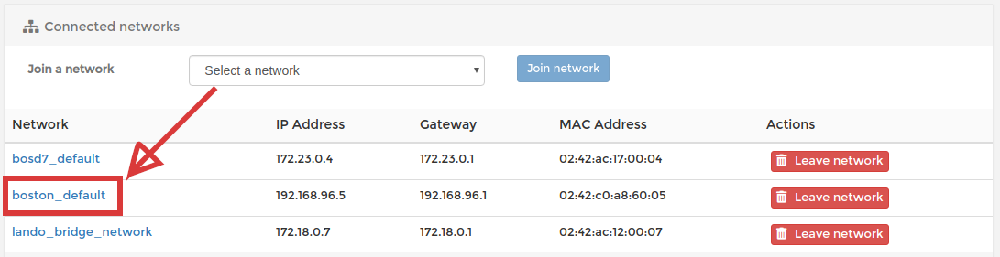
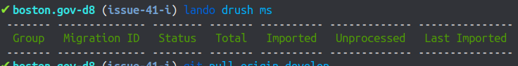
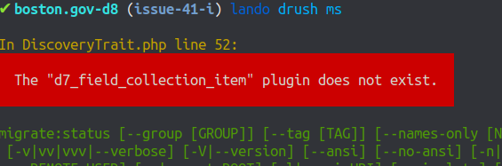
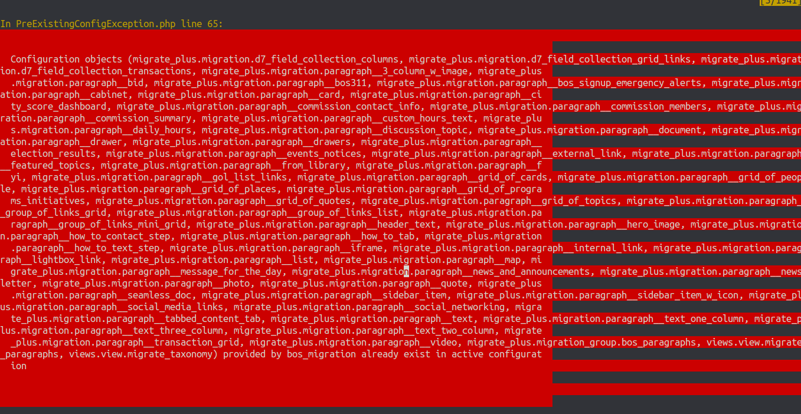

# Connecting D7 and D8 databases for migration

1. Spin up the D7 environment in lando \(`lando start`, then `lando build-bos`\) and spin up the D8 environment \(`lando start`\) separately. 

2. Go to your local [portainer](https://www.portainer.io/) \([http://portainer.lndo.site:9090](http://portainer.lndo.site:9090) sign in with admin, admin\). Then click on "Containers &gt; bosd7\_database\_1", scroll to the bottom and join network `boston_default`. 



3. Make sure your `docroot/sites/default/settings/settings.local.php` on D8 has the information it needs to connect to D7:

```text
$databases['migrate']['default'] = [
  'driver' => 'mysql',
  'database' => 'drupal',
  'username' => 'drupal',
  'password' => 'drupal',
  'host' => 'bosd7_database_1',
  'port' => '3306',
];
```

4. Test your connection by checking the migration status in D8 `lando drush ms`

### Troubleshooting

If `lando drush ms` has a blank output



Try running the following:

```text
lando drush cim --partial --source=modules/custom/bos_migration/config/install/ -y; and lando drush cr; and lando drush ms
```

If you see errors like "The "d7\_field\_collection\_item" plugin does not exist."



You need to:

```text
lando drush en devel,dblog,automated_cron,syslog,twig_xdebug,config_devel
```

then:

```text
lando drush en migrate,migrate_utilities,migrate_upgrade,migrate_drupal,migrate_drupal_ui,field_group_migrate,migrate_plus,migrate_tools,bos_migration 
```

If running the above commands results in a bunch of warning about existing config objects



You can clear those out by running:

```text
lando ssh
cd docroot/
drush php:eval '_bos_core_uninstall_boston("bos_migration");'
```

For more info, checkout: [https://www.drupal.org/docs/8/api/migrate-api/migrate-source-plugins/migrating-data-from-a-sql-source](https://www.drupal.org/docs/8/api/migrate-api/migrate-source-plugins/migrating-data-from-a-sql-source)

