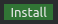
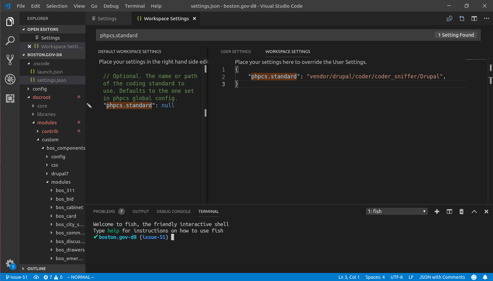

# VSCode IDE Setup

#### Add XDebug


1. Under Extensions in the left sidebar, search for "PHP Debug" and click "Install"  
2. Edit `.vscode/launch.json`   
3. Add the following configuration:

```text
{
    "version": "0.2.0",
    "configurations": [
        {
            "name": "Listen for XDebug",
            "type": "php",
            "request": "launch",
            "port": 9000,
            "pathMappings": {
              "/app/": "${workspaceRoot}/",
            }
        },
        {
            "name": "Launch currently open script",
            "type": "php",
            "request": "launch",
            "program": "${file}",
            "cwd": "${fileDirname}",
            "port": 9000
        }
    ]
}
```

#### Add Drupal coding standards



1. Under Extensions in the left sidebar, search for "phpcs" and click "Install"  
2. Click in top navbar navigate to `file > preferences > settings` 
3. Under `Workspace Settings` expand the `Extensions` option 
4. Locate `PHP CodeSniffer configuration` and scroll down to the `Standard` section and click the "Edit in settings.json" link
5. Add the following configuration to your `Workspace Settings`:

```text
{
    "phpcs.standard": "vendor/drupal/coder/coder_sniffer/Drupal",
}
```

