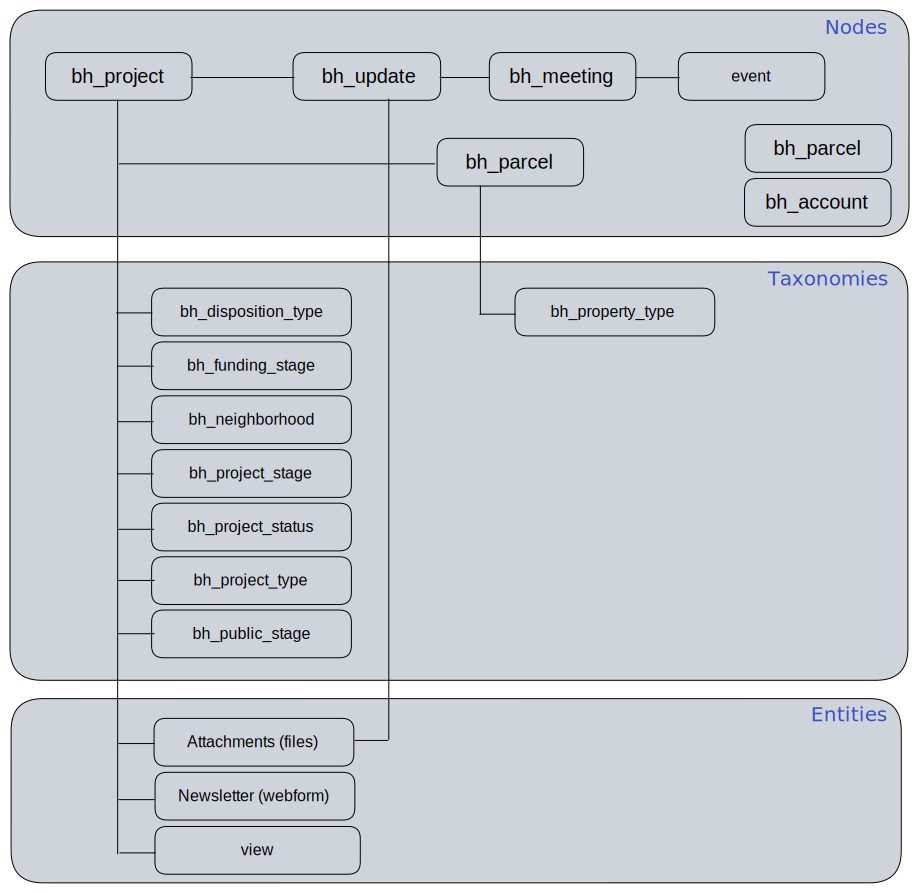

# Drupal Entities


The following nodes have records which are populated (add, update and delete) by mappings between Salesforce and Drupal which are run each cron cycle.

The following taxonomies have been created and their list items are maintained manually by Drupal developers.  Taxonomy items can be added and deleted as needed, but usually will need adjustments to code to work as required.


| Type     | Name                            | Description                                                                                                                                                                                                       |
| -------- | ------------------------------- | ----------------------------------------------------------------------------------------------------------------------------------------------------------------------------------------------------------------- |
| node     | bh\_project                     | The primary content\_type for a Building Housing Property. Contains meta data about the Project and links to updates, attachments, parcels etc.                                                                   |
| node     | bh\_update                      | Contains information about updates to a project. This includes certain status changes, attached documents, links to community meeting records and comments from CoB Project Managers to insert into the timeline. |
| node     | bh\_meeting                     | Contains information about Community Meetings held by CoB with residents regarding Building Housing Properties.                                                                                                   |
| node     | bh\_parcel                      | The official parcel number and top-level info - with GIS coordinates for the parcel.                                                                                                                              |
| node     | bh\_parcel\_project\_assoc      | 
Possibly deprecated ? <em>I believe the parcel# is now saved in the field_bh_parcel_id field of bh_project.</em>
                                                                                        |
| node     | bh\_contact                     |                                                                                                                                                                                                                   |
|          |                                 |                                                                                                                                                                                                                   |
| taxonomy | bh\_project\_stage              | 
The overall project stage. (usually when project status = active).

Linked directly from <code>bh_project</code>.
                                                                                     |
| taxonomy | bh\_project\_status             | 
The status of the Project.

Linked directly from <code>bh_project</code>.
                                                                                                                             |
| taxonomy | bh\_funding\_stage              | 
The funding stage for the Project. Linked directly from <code>bh_project</code>.
                                                                                                                        |
| taxonomy | bh\_project\_type               | 
The broad project type for the Project. Linked directly from <code>bh_project</code>.
                                                                                                                   |
| taxonomy | bh\_project\_update\_type       | 
Update type for a <code>bh_update</code>. Linked directly from <code>bh_update</code>.
                                                                                                                  |
| taxonomy | bh\_property\_type              | 
The property type. Linked directly from <code>bh_parcel</code>.
                                                                                                                                         |
| taxonomy | bh\_public\_stage               | 
The Project stage as used in the timeline.

Linked directly from <code>bh_project</code>.
                                                                                                             |
| taxonomy | bh\_neighborhood                |                                                                                                                                                                                                                   |
| taxonomy | bh\_record\_type                |                                                                                                                                                                                                                   |
| taxonomy | bh\_disposition\_type           | List of disposition types - for use in map.                                                                                                                                                                       |
|          |                                 |                                                                                                                                                                                                                   |
| view     | building\_housing               |                                                                                                                                                                                                                   |
|          |                                 |                                                                                                                                                                                                                   |
| page     | buildinghousing/\[propertyname] | 
This is the landing page for information about a property. This is a customized page for the node <code>bh_project</code> and contains a timeline and information about parcels.
                        |

