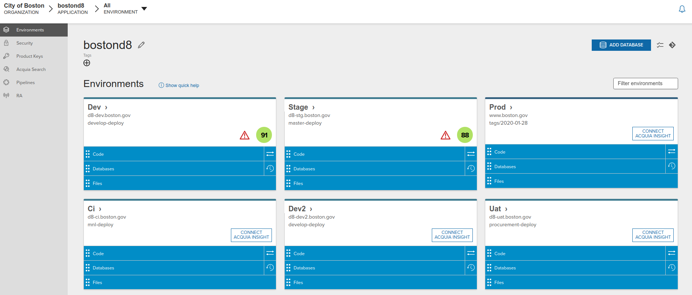

# On Demand Instances

On demand instances of the Drupal site \(boston.gov\) are useful to demonstrate new features or functionality sand-boxed away from the [continuous-deployment process. ](https://docs.boston.gov/digital/guides/drupal-8/continuous-deployment-process)

These on demand versions of boston.gov are designed to be housed on a near-duplicate environment to the production site, and be [easily accessible](https://docs.boston.gov/digital/guides/drupal-8/on-demand-instances#public-urls-for-the-on-demand-environments) in a normal browser from anywhere by people with the correct link.



Acquia provide 6 environments to CityOfBoston.




The `dev, stage(test) and prod`environments are associated with git branches used in the [continuous-deploy workflow](https://docs.boston.gov/digital/guides/drupal-8/continuous-deployment-process) and **can not** be attached to different branches or repository tags without disrupting and potentially breaking the workflow.



The `dev2, dev3, ci and uat` environments can track any desired branch or tag \(even `develop-deploy` or `master-deploy` \) without disrupting the [continuous-deployment workflow](https://docs.boston.gov/digital/guides/drupal-8/continuous-deployment-process).





This process has been decommissioned and some of the processes below are no longer implemented in scripts.

This page is left here only to provide background should COB decide/require to have Drupal in an AWS managed container.


You can push your local repository up to a test instance on our staging cluster on AWS. This will let you show off functionality using data from a staging snapshot of Boston.gov.

### **Prerequisites**

* You will need a full development environment and Drupal 8 installed on your local machine \(refer to earlier notes\).
* Install the [AWS Command Line Interface](https://aws.amazon.com/cli/).
* Get a “CLI” IAM user with an access key and secret key.
* Use `aws configure` to log your CLI user in locally. Use `us-east-1` as the

  default region.


Request your CLI IAM user credentials from DoIT.


### **Setup On Demand \(Infrastructure\)**

To create a place to upload your code, follow the instructions in the [CityOfBoston/digital-terraform](https://github.com/CityOfBoston/digital-terraform) repository to make a “variant” of the Boston.gov staging deployment.

### **Pushing local code**

To push your local repository up to the cluster, run:

```text
$ ./doit stage <variant>
```

Where `<variant>` is the variant name you created in `CityOfBoston/digital-terraform`.

This will build a container image locally and upload it to ECR. It will then update your staging ECS service to use the new code.

By default, the container startup process will initialize its MySQL database with a snapshot of the staging environment from Acquia.

After the container starts up and is healthy, the `doit` script will print useful URLs and then quit.

### **Running drush on staging**

Direct SSH access is not generally available on the ECS cluster. To run `drush` commands on your test instance, you can visit the `webconsole.php` page at its domain. This will give you a shell prompt where you can run _e.g._ `drush uli` to get a login link.

The `webconsole.php` shell starts in `docroot`.


Talk to another DoIT developer to get the webconsole username and password.


### **Preserving the database between pushes**

**NOTE**: Each time you deploy code to your test instance it starts with a fresh copy of the Drupal database.

If you want to preserve state between test runs, log in to `webconsole.php` and run:

```text
$  ../doit stash-db
```

\(The `..` is because `webconsole.php` starts in the `docroot`.\)

This will take a snapshot of your database and upload it to S3. The next time your test instance starts up, it will start its sync from this database rather than the Acquia staging one.


The database will also be destroyed when the AWS containers are restarted for any reason.  It is good practice to stash your DB regularly.


To clear the stash, so that your database starts fresh on the next test instance push, use `webconsole.php` to run:

```text
$ ../doit stash-db reset
```

Here is a snapshot of the doit script referred to above.

```text
# Pushes the current repository to an ECS service in our staging cluster. Set up
# the services by adding a "variant" to the boston_gov_deploy module in the
# Terraform configuration.
function doitstage() {
   doitcomment "Creates a container using files in the current working folder."
   doitcomment "Variables and deploy flags can be set in the file /scripts/terraform/drupal." "No local files will be altered by this process."
   # Manage logs folder
   rm -f $REPO_ROOT/setup/terraform/*
   mkdir $REPO_ROOT/setup/terraform > /dev/null 2>&1
   LOG_FILE=$REPO_ROOT/setup/terraform/terraform_build.log
   doitcomment "View build log at: ${LOG_FILE}." ""
   doitcomment "... or /app/setup/terraform/terraform_build.log (inside the container)." ""

  # These defaults could presumably be put somewhere else, or even be allowed to
  # be overridden, but for our purposes they really don’t change.
  region="us-east-1"
  cluster="AppsStaging"
  cluster_namespace="cob-digital-apps-staging"
  service_base="boston-gov"
  drupal_container_name="drupal"

  variant="${args[0]:-default}"

  if [ "${variant}" == "default" ]; then
    service="${service_base}"
  else
    service="${service_base}-${variant}"
  fi

  # This refreshes Docker with our AWS credentials so we can push to ECR.
  doitcomment "Logging in to AWS."
  `aws ecr get-login --no-include-email`

  # The ECR repositories have the account ID in the URL. Rather that hard-code
  # it, which is not super-great, we can pull it dynamically.
  account_id=`aws sts get-caller-identity | jq '.["Account"]' -r -`
  repository_url="${account_id}.dkr.ecr.${region}.amazonaws.com/${cluster_namespace}/${service_base}:deploy-${variant}"

  # Build an image which we can send to AWS/ECR.
  # NOTE: Only build the "appserver"/apache image as the mysql image is standard and already exists on the AWS env.
  doitcomment "Building the container image." "Please wait ... (5-10 mins)"
  # Copy local ssh keys so they can be added to container.
  echo -e "STAGING: ${variant}." > $LOG_FILE 2>&1
  echo -e "\nSSH: Copying the local ssh keys into /app folder.\n" >> $LOG_FILE 2>&1
  mkdir .ssh  >> $LOG_FILE 2>&1
  cp -rf ~/.ssh/id_rsa* ./.ssh >> $LOG_FILE 2>&1
  rm -f ./.ssh/known_hosts >> $LOG_FILE 2>&1
  touch ./.ssh/known_hosts
  rm -f ./.ssh/config >> $LOG_FILE 2>&1
  rm -rf ./setup/*.* >> $LOG_FILE 2>&1

  # Build & check result.
#  echo -e "\nDOCKER: Removing existing images (if any).\n" >> $LOG_FILE 2>&1
#  docker rmi $repository_url >> $LOG_FILE 2>&1
  echo -e "\nDOCKER: Building the application container (--no-cache).\n" >> $LOG_FILE 2>&1
#  docker build --pull --no-cache -f scripts/docker-terraform/drupal \
  docker build --pull -f scripts/docker-terraform/drupal \
                     --build-arg "LANDO_APP_NAME=${service}" \
                     --build-arg "LANDO_DOMAIN=digital-staging.boston.gov" \
                     -t $repository_url . >> $LOG_FILE 2>&1
  if [ $? -eq 0 ]; then
     doitcomment "Success.\n"
      echo -e "\nDOCKER: Success.\n" >> $LOG_FILE 2>&1
  else
    echo -ne "${Red}The container build failed.${NC}\n${LightRed}   Please check for errors in console above.${NC}\n"
    exit 1
  fi
  # Tidy-up: remove locally copied ssh keys.
  rm -rf ./.ssh >> $LOG_FILE 2>&1
   echo -e "\nDOCKER: Copying the local ssh keys into /app folder.\n" >> $LOG_FILE 2>&1

  # Push the new self-contained container to AWS.
  doitcomment "Pushing to ECR." "Please wait ... (another 2-5 mins!)"
  docker tag $repository_url >> $LOG_FILE 2>&1
  docker push $repository_url >> $LOG_FILE 2>&1
  if [ $? -eq 0 ]; then
     doitcomment "Success.\n"
      echo -e "\nDOCKER: Success.\n" >> $LOG_FILE 2>&1
  else
    echo -ne "${Red}The container push to ECR failed.${NC}\n${LightRed}   Please check for errors in console above.${NC}\n"
    exit 1
  fi

  # The service should already have been created by Terraform, with a task
  # definition that points to the "deploy-${variant}" tag used above. Forcing a
  # new deployment will cause ECS to run new tasks, which will pick up the new
  # container image we just pushed.
  #
  # We use jq on the output to pull the deployment ID that this update created
  # so we can monitor its tasks later on.
  #
  # TODO(finh): It would be good to automatically use the latest task definition
  # for this update. Right now this just redeploys whatever task definition is
  # already on the service.
  #
  # This means that if you update the task definition through Terraform, say to
  # change memory or environment variables, you need to run an update through the
  # ECS UI to put the service on the latest task definition.
  doitcomment "Updating service ${service}."
  deployment_id=`aws ecs update-service \
    --output json \
    --cluster "${cluster}" \
    --service "${service}" \
    --desired-count 1 \
    --force-new-deployment \
    | jq '.["service"]["deployments"][] | select(.status == "PRIMARY") | .id' -r -`

  doitcomment "Awaiting task creation. Events:" "https://console.aws.amazon.com/ecs/home?region=${region}#/clusters/${cluster}/services/${service}/events"

  # TODO(finh): Stream the service events until the task starts up so that we
  # can see if there are any task placement errors or anything.

  # Polling until AWS creates the task in the service update’s deployment.
  task_arn="null"
  while [ "${task_arn}" == "null" ]; do
    sleep 5
    task_arn=`aws ecs list-tasks \
      --output json \
      --cluster "${cluster}" \
      --started-by "${deployment_id}" | jq '.["taskArns"][0]' -r -`
  done

  # Task ARN is something like
  # arn:aws:ecs:<region>:<aws_account_id>:task/c5cba4eb-5dad-405e-96db-71ef8eefe6a8
  # We get just the ID from the end because that’s what future commands use.
  # (list-tasks only returns ARNs.)
  task_id=`[[ "${task_arn}" =~ /(.*)$ ]] && echo ${BASH_REMATCH[1]}`

  logs_url="https://console.aws.amazon.com/cloudwatch/home?region=${region}#logEventViewer:group=${cluster}/${service_base};stream=ecs/drupal/${task_id}"
  doitcomment "Task created." "Streaming CloudWatch logs."

  # We expect the aws logs call to return 255 until the stream is created, so we
  # don’t want the script to crash while that happens.
  set +e

  # Keeping track of the "forward token" will let us only get new logs with each
  # poll. "f/0" seems to work as a "start from the beginning" token.
  next_forward_token="f/0"

  doitcomment "Initializing container on EC2." "Please wait ... (and another 5-10 mins!)"

  done=0
  while [ $done -eq 0 ]; do
    # We save the results into $events because we need to both print the
    # messages but also parse out the "nextForwardToken" for the next time
    # through the loop. We use 2>&1 to capture stdout and stderr so that we
    # swallow any expected "logs not created yet" error messages.
    events=$(aws logs get-log-events \
      --output json \
      --log-group-name "${cluster}/${service_base}" \
      --log-stream-name "ecs/${drupal_container_name}/${task_id}" \
      --next-token "${next_forward_token}" 2>&1)

    # As mentioned above, we start polling before the log stream is necessarily
    # created (the task may still be in PENDING state when it appears in
    # "list-tasks"). During that time the get-log-events will exit with an error
    # code.
    if [ $? -eq 0 ]; then
      next_forward_token=$(echo "${events}" | jq '.["nextForwardToken"]' -r -)
      echo "${events}" | jq '.["events"][]["message"]' -r -
    fi

    # If we’re starting to see health checker lines coming from the Apache logs
    # then the server is running.
    if [[ "${events}" =~ ELB-HealthChecker ]]; then
      done=1
    else
      sleep 1
    fi
  done

  doitcomment "Finalize: Waiting for build to complete (60 second timeout)."
  set -e
  count=0

  # At this point the old task is still taking traffic, so we don’t want to
  # direct anyone to the URLs because they might log in to the old task rather
  # than the new one. After 60 seconds the health checks should succeed and the
  # ALB will start sending traffic to the new task.
  while (( count < 4 )); do
    echo -n "."
    sleep 15
    ((count+=1))
  done

  # Also, at this time the run-staging-container is building drupal.
  # Start polling the user/login page, when it is available, then we have
  # a functioning environment.
  done=1
  while (( done == 1 )); do
    echo -n "."
    sleep 15
    ((count+=1))
    curl -s --head https://${service}.digital-staging.boston.gov/user/login | head -n 1 | grep "HTTP/[1-9] [23].." > /dev/null
    done=$?
    # on success (page exists), $? will be 0; on failure (page does not exist or
    # is unreachable), $? will be 1

    # set a 10 minute timeout ...
    if (( count == 40 )); then
      done=0
      echo -ne "\n${Red}The container build appears to have failed.${NC}\n${LightRed}   Please check for errors in console or cloudwatch logs.${NC}\n"
      doitcomment "Web console:" "https://${service}.digital-staging.boston.gov/webconsole.php"
      doitcomment "CloudWatch logs:" "${logs_url}"
      exit 1
    fi
  done

  doitcomment "Staging ready!" "https://${service}.digital-staging.boston.gov/"
  doitcomment "Login:" "https://${service}.digital-staging.boston.gov/user?local"
  doitcomment "Web console:" "https://${service}.digital-staging.boston.gov/webconsole.php"
  doitcomment "CloudWatch logs:" "${logs_url}"
}

function doitstashdb() {
  subcommand="${args[0]}"

  if [ "${subcommand}" = "help" ]; then
    echo ""
    echo " Manage on-demand database:"
    echo ""
    echo "  stash reset   Deletes any existing databases."
    echo "  stash fetch   Copies a previous database into the container."
    echo "  stash dump    Creates and saves (to AWS) a backup of the database."
    echo "  stash status  Provides timestamp of the currently stashed database."
    echo "  stash help    Show this page."
    echo ""
    echo " Notes:"
    echo " 1. Only works when executed in an AWS on-demand container."
    echo " 2. dump command:  Only one backup can be saved at a time -executing 'dump'."
    echo "                   overwrites any previous dump/s."
    echo " 3. fetch command: The database is just copied back into the container and "
    echo "                   is not restored. After 'fetch', use mysql or phing "
    echo "                   commands to restore the database."
    echo " 4. If the container is restarted, then the current database dump (stashed using"
    echo "    'doit stash dump') will be automatically restored - any unstashed changes"
    echo "    will be lost."
      if [ -z "${AWS_S3_DATABASE_URL}" ]; then
        echo ""
        echo "** WARNING: This does not appear to be an AWS container."
        echo ""
      fi
    exit
  fi

  # Verify
  if [ -z "${AWS_S3_DATABASE_URL}" ]; then
    echo '$AWS_S3_DATABASE_URL not set. You must run this command on staging.'
    exit -1
  fi

  s3_dump_location="${AWS_S3_DATABASE_URL}/dump.sql.gz"

  if [ "${subcommand}" = "reset" ]; then
    # We need to delete a dump on AWS/S3.
    echo "Deleting database dump from S3."
    aws s3 rm "${s3_dump_location}"
    exit
  fi

  if [ "${subcommand}" = "fetch" ]; then
    # We need to grab a previous dump from AWS/S3.
    echo "Fetching dump from S3"

    # copy the dump from AWS to our temp folder.
    aws s3 cp "${AWS_S3_DATABASE_URL}/dump.sql.gz" /tmp/ || echo "dump.sql.gz not found on S3"

    if [ -f /tmp/dump.sql.gz ]; then
      # Uncompress the dump in-place/
      echo "Ungzipping"
      gunzip /tmp/dump.sql.gz
      # Necessary to allow the Apache user to delete this. webconsole.php runs
      # as www-data.
      chown www-data /tmp/dump.sql
    fi

    # NOTE: the dump has not been loaded back into MySQL at this point.
    exit
  fi

  if [ "${subcommand}" = "status" ]; then
    # We need to grab a previous dump from AWS/S3.
    echo "Fetching dump information from S3"

    # See if we can access the AWS folder.
    aws s3 ls "${AWS_S3_DATABASE_URL}/" > /dev/null 2>&1 || echo "Error: Cannot access Amazon backup area."

      # Extract the date of the backup.
    aws s3 ls "${AWS_S3_DATABASE_URL}/" | grep dump.sql.gz | awk '{print "\n   - DB backup date: " $1 " at " $2 "\n"}' || echo "Error: Cannot find any DB backup files."

    exit
  fi

  echo "Stashing Database. "
  echo " - If you receive a red AJAX error, wait 60 secs and check the stashed DB status using './doit stash status'."

  # Use Drush to dump the database to the temp folder.
  echo "Dumping database SQL."
  drush --root=/app/docroot sql-dump > /tmp/dump.sql

  # Compress the dump file in-place.
  echo "Gzipping dump."
  rm -f /tmp/dump.sql.gz
  gzip /tmp/dump.sql

  # Now copy the compressed dump across to AWS/S3.
  echo "Uploading to S3."
  aws s3 cp --no-progress /tmp/dump.sql.gz "${s3_dump_location}"

  echo "Success - complete."
  echo "You can check using doit stash status"

}
```



## Set-up a site branch \(or tag\) on Acquia.

_**Elsewhere this might be termed spinning up an on-demand instance of the site.**_

1. Make sure you have the latest copy of the main Drupal 8 repository cloned to a folder `<repo-root-path>.`Checkout the branch `develop` and make sure the latest commits are pulled \(fetch+merged\) locally.
2. Commit your work to a new branch \(`on-demand-branchname`\) off the `develop` branch .
3. Push that branch to GitHub, but _**do not**_ create a PR or merge into `develop`.
4. Edit `<rep-root-path>/.travis.yml` file and make the following additions:  
   \(**Note:** replace `<on-demand-branchname>` with `on-demand-branchname`.\)

   ```text
   branches:
     only:
       - develop
       - master
   =>== Addition ===
       - <on-demand-branchname>
   <=== Addition ===
    
     ... existing config ...

   deploy:
     - provider: script
       skip_cleanup: true
       script: bash scripts/deploy/travis-deploy.sh $TRAVIS_BRANCH
       on:
         branch: develop
     - provider: script
       skip_cleanup: true
       script: bash scripts/deploy/travis-deploy.sh $TRAVIS_BRANCH
       on:
         branch: master
   =>== Addition ===
     - provider: script
       skip_cleanup: true
       script: bash scripts/deploy/travis-deploy.sh $TRAVIS_BRANCH
       on:
         branch: <on-demand-branchname>
   <=== Addition ===
   ```

5. Edit `<rep-root-path>/scripts/local/.config.yml` file and make the following additions:  
   \(**Note:** This partial example addition is configured to deploy to the Ci environment on Acquia\)  
   \(**Note:** replace `<on-demand-branchname>` with `on-demand-branchname`.\)

   ```text
   project:
  
   ... existing config ...

   build:
     travis:
       develop:
         ... existing config ...
      
       master:
         ... existing config ...
      
   =>== Addition ===    
       <on-demand-branchname>:
         # With Travis, the type will control what type of build is deployed to Acquia (dev/prod).
         type: dev
         suppress_output: 0
         database:
           # Set source to 'initialize' to start a fresh install.
           # Otherwise set it to sync to sync from the drush-alias environment.
           source: initialize
           drush_alias: "@bostond8.test"
         config:
           # define the folder, relative to the drupal docroot, for config files to be synchronised, no trailing slash.
           # aquia require ./config/default:
           #     @see https://docs.acquia.com/acquia-cloud/develop/config-d8/
           sync: "../config/default"
   <=== Addition ===

   deploy:
     develop:
       ... existing config ...
    
     master:
       ... existing config ...
    
   =>== Addition ===    
     <on-demand-branchname>:
       # Folder in Travis container where deploy files will be "built"
       dir: ${LANDO_MOUNT}/deploy
       # Name of the target branch in the Acquia repo.
       deploy_branch: <on-demand-branchname>-deploy
       # Path to the drush command in the Travis container.
       travis_drush_path: '${LANDO_MOUNT}/vendor/bin/drush'
       # Alias for deploy target Aquia server. Ci or Uat
       drush_alias: "@bostond8.ci"
       # Definition of files that will and wont be copied from build to deploy.
       includes_file: ${LANDO_MOUNT}/scripts/deploy/deploy-includes.txt
       excludes_file: ${LANDO_MOUNT}/scripts/deploy/deploy-excludes.txt
       sanitize_file: ${LANDO_MOUNT}/scripts/deploy/deploy-sanitize-files.txt
       # Message we want to appear in Acquia repo for the deployment commit.
       commit_message: "Automated commit by Travis CI for Build \#\${travis.id}"
       # Dry-run (for testing).
       dry_run: false
       # Whether (and where) to sync the database on the deploy target. NB: copy-db=false means db left intact.
       copy_db: false
       drush_db_source: "@bostond8.test"
       # Array of user:host for (Acquia) git remotes to be used for deployment.
       remotes:
         - bostond8@svn-29892.prod.hosting.acquia.com:bostond8.git
   <=== Addition ===

   git:
     ... existing config ...
  
   ```

6. Commit the `.config.yml and .travis.yml`changes to `on-demand-branchname` and push to GitHub - but _**do not**_ merge into `develop`.
7. Make a small inconsequential change to the code and commit to the `on-demand-branchname` branch, and push to GitHub.  This will cause the first-time build on Travis, and deploy into the `on-demand-branchname-deploy` branch in the Acquia Repository.

   The Travis build can be [tracked here in Travis](https://travis-ci.org/CityOfBoston/boston.gov-d8?utm_medium=notification&utm_source=github_status).

8. Login to the Acquia Cloud console.  In the UI switch the code in the Ci/Uat environment to the `on-demand-branchname-deploy` branch.   This will cause a [deploy on the Acquia server](https://cloud.acquia.com/app/develop/applications/5ad427f5-60d6-48fd-983e-670ddc7767c4), which will copy across the current `stage` database and update with configuration from the `on-demand-branchname`branch.
9. **The "on-demand" environment is now set.** Users may view and interact with the environment as required.  See Notes in "gotcha's" box below.
10. Once you have finished the demo/test/showcase cycle, you can merge the `on-demand-branchname` branch to `develop` - provided you wish the code changes to be pushed through the continuous-deploy process to `production`.
11. Finally you can detach the `on-demand-branchname` branch from the Acquia environment, and set it back to the `tags/welcome` tag.

### Public URL's for the on-demand environments.

You can direct users to the URL's below, select the environment you switched to the `on-demand-branchname-deploy` branch \(in step 8\) from the table below.

<table>
  <thead>
    <tr>
      <th style="text-align:left">Environment</th>
      <th style="text-align:left">URL</th>
    </tr>
  </thead>
  <tbody>
    <tr>
      <td style="text-align:left">uat</td>
      <td style="text-align:left">
        <p><a href="https://d8-uat.boston.gov">https://d8-uat.boston.gov</a>
        </p>
        <p>(public DNS entry)</p>
      </td>
    </tr>
    <tr>
      <td style="text-align:left">ci</td>
      <td style="text-align:left">
        <p><a href=" https://d8-ci.boston.gov">https://d8-ci.boston.gov</a>
        </p>
        <p>(public DNS entry)</p>
      </td>
    </tr>
    <tr>
      <td style="text-align:left">dev2</td>
      <td style="text-align:left">
        <p><a href=" https://d8-dev2.boston.gov">https://d8-dev2.boston.gov</a>
        </p>
        <p>(no DNS - make entry in local hosts file)</p>
      </td>
    </tr>
    <tr>
      <td style="text-align:left">dev3 (pending)</td>
      <td style="text-align:left">
        <p>https://d8-dev3.boston.gov</p>
        <p>(no DNS - make entry in local hosts file)</p>
      </td>
    </tr>
  </tbody>
</table>
**Housekeeping**.  
When finished with the environment, you should consider rolling-back the changes you made to `.travis.yml` and `.config.yml` in steps 4 & 5 before finally merging `on-demand-branchname` to `develop.`  
It is likely that the on-demand instance is no longer required, and its unnecessary for the the `on-demand-branchname` to be tracked by Travis.

Also as a courtesy, change the branch on the environment back to `tags/WELCOME` so it is clear that the environment is available for use by other developers.


### On-demand instance gotcha's:


1. **Updating:** If you push changes to `on-demand-branchname` in GitHub \(which eventually causes Acquia's`on-demand-branchname-deploy`to be updated\) - then in Aquia's terminology you are "_updating_" the code.  Any commits you push to the GitHub`on-demand-branchname` will cause [Travis to rebuild](https://travis-ci.org/CityOfBoston/boston.gov-d8?utm_medium=notification&utm_source=github_status) and update the code on the[ Ci/Uat environment](https://cloud.acquia.com/app/develop/applications/5ad427f5-60d6-48fd-983e-670ddc7767c4) and this will cause Acquia's`post-code-update` hook script to run.   - That update-hook script will backup your database and update and new configurations but will not update or overwrite any content \(so changes made by users will be retained\).
2. **Deploying:** If you switch the code on the Acquia server from `on-demand-branchname-deploy` to some other branch or tag, and then back again - then in Acquia's terminology each switch of branch is a "_deploy_" of the code.  GitHub is not affected by this change, so nothing will run on Travis, but once each switch is complete, Acquia's`post-code-deploy`hook script will run. - That deploy-hook script will sync the database from the `stage` environment and will overwrite any content in the database.  Therefore, any content previously added/changed by users will be lost.



