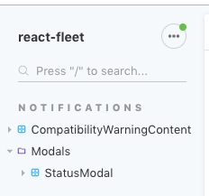
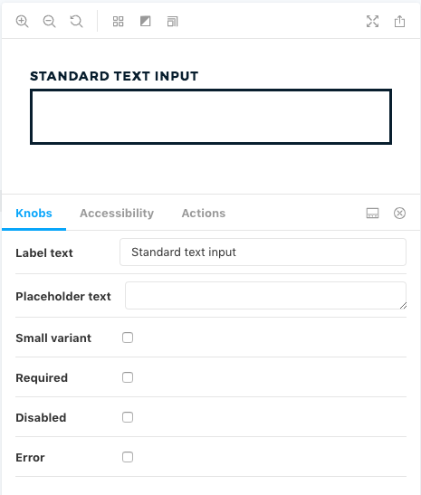
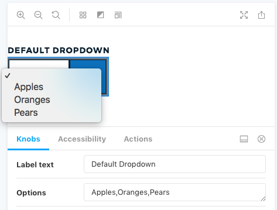
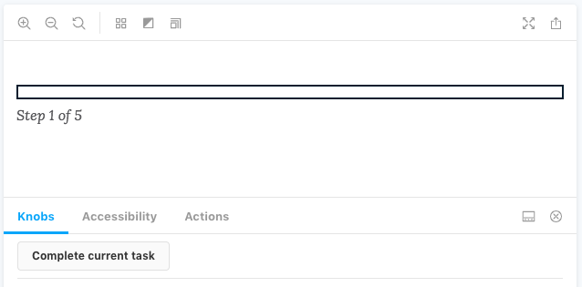

# Storybook

Storybook lets us:

* quickly build UI components in isolation
* mock out a component’s different states/variations
* experiment and test with different props \(i.e. what happens if the text for a label is really, really long?\)

It also:

* provides documentation of our components
* is used by Percy to perform its visual diffs
* works with Jest to do automatic code snapshot testing \([StoryShots addon](https://github.com/storybooks/storybook/tree/master/addons/storyshots/storyshots-core)\)
* can catch simple a11y violations as soon as they occur \([a11y addon](https://github.com/storybooks/storybook/tree/master/addons/a11y)\)

## Writing Stories


If you write a Story for every different use case or state of a component, Percy will take a snapshot and catch any visual changes later on.


### Setting where a Story should be organized in the sidebar


```jsx
storiesOf('Notifications|CompatibilityWarningContent', module)
```



```jsx
storiesOf('Notifications|Modals/StatusModal', module)
```





If you group any Stories \(i.e. Group\|Folder/Story\) in your Storybook, Stories without a defined group will now appear in an automatically-generated "Others" group in the sidebar.


### The most basic Story

```jsx
import React from 'react';
import { storiesOf } from '@storybook/react';

import MyComponent from './MyComponent';

storiesOf('Group|Folder/MyComponent', module)
  .add('default', () => (
    <MyComponent />
  ));
```

You can have multiple `storiesOf` blocks if it helps you stay organized; any blocks that share a name string will be combined in the sidebar as a single collection of Stories.

### Using a visual wrapper component

Good for components that stretch too wide without a container. Using [`addDecorator`](https://storybook.js.org/docs/addons/introduction/#storybook-decorators), all of the Stories will be children of the wrapper component.

```jsx
import React from 'react';
import { storiesOf } from '@storybook/react';

import MyComponent from './MyComponent';

const NARROW_STYLING = {
  maxWidth: '600px',
  margin: '2rem auto',
};

storiesOf('Group|Folder/MyComponent', module)
  .addDecorator(story => <div style={NARROW_STYLING}>{story()}</div>)
  .add('default', () => (
    <MyComponent />
  ))
  .add('variant', () => (
    <MyComponent />
  ));
```

### Allowing for quick prop changes

The Knobs addon lets us change the props passed into our component inside Storybook’s UI. It’s super helpful to quickly test out component appearance against different values.

Documentation: [https://github.com/storybooks/storybook/tree/master/addons/knobs](https://github.com/storybooks/storybook/tree/master/addons/knobs)

```jsx
import React from 'react';

import { storiesOf } from '@storybook/react';
import { withKnobs, boolean, text } from '@storybook/addon-knobs';

import TextInput from './TextInput';

storiesOf('Form Elements|Inputs/TextInput', module)
  .addDecorator(withKnobs)
  .add('default', () => (
    <TextInput
      label={text('Label text', 'Standard text input')}
      placeholder={text('Placeholder text', '')}
      small={boolean('Small variant', false)}
      required={boolean('Required', false)}
      disabled={boolean('Disabled', false)}
      error={boolean('Error', false)}
    />
  ));
```



#### Add/remove options from a &lt;select&gt;

```jsx
import React from 'react';

import { storiesOf } from '@storybook/react';
import { withKnobs, array, text } from '@storybook/addon-knobs';

import SelectDropdown from './SelectDropdown';

storiesOf('Form Elements|SelectDropdown', module)
  .addDecorator(withKnobs)
  .add('default', () => (
    <SelectDropdown
      label={text('Label text', 'Default Dropdown')}
      options={array('Options', ['Apples', 'Oranges', 'Pears'])}
    />
  ));
```



#### Simulate performing an action

You can also use Knobs to add buttons that trigger a change in UI:

```jsx
import React from 'react';

import { storiesOf } from '@storybook/react';
import { withKnobs, button } from '@storybook/addon-knobs';

import ProgressBar from './ProgressBar';

class InteractiveStep extends React.Component<Props, State> {
  constructor(props) {
    super(props);

    this.state = {
      completed: false,
    };
  }

  render() {
    const label = 'Complete current task';
    const handler = () => this.setState({ completed: true });

    button(label, handler);
    
    return (
      <ProgressBar
        totalSteps={taskList.length}
        currentStep={this.props.currentStep}
        currentStepCompleted={this.state.completed}
      />
    );
  }
}

storiesOf('ProgressBar', module)
  .addDecorator(withKnobs)
  .add('default', () => (
    <InteractiveStep currentStep={1} />
  ));
```



