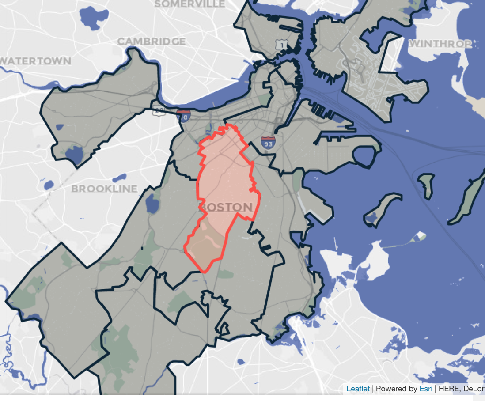

# Maps on boston.gov

## Maps that have been created

This [spreadsheet](https://docs.google.com/spreadsheets/d/1qBQrTCPEveSf-M6sPJ1HVInlijNmvXrf156Wc5o38UY/edit?usp=sharing) contains all maps in that have been created. If updating that spreadsheet gets away from you and you want to know what pages on boston.gov are using maps, ask a Drupal dev on the Digital Team to run this query:

```sql
select n.type, nfd.title, nfd.status, concat('https://www.boston.gov/node/', n.nid) as link
from paragraph__field_map_inline pm
inner join node__field_components nc on pm.entity_id = nc.field_components_target_id
inner join node n on nc.entity_id = n.nid
inner join node_field_data nfd on n.nid = nfd.nid
where pm.bundle = 'map'
```

That will give you an output that looks something like this JSON file (last ran 10/1/20). A "1" in the status field means they are published pages and publicly accessible, a "0" means they are not published and cannot be seen unless the user can log into the website.


JSON file of maps on boston.gov


It's important to note that maps will come on and off the website with time as many of them are seasonal or for certain events. Therefore, you may not always be able to see the maps on the pages linked to in the spreadsheet above or in the output of that query. If you need to assist in getting a map that once was on the site but now isn't one of two things can happen:

1. The Digital Team can get to old JSON configuration file from a past revision of the page and you can work off that to start
2. You should be able to find the JSON in [this Google Drive folder](https://drive.google.com/drive/folders/1nJNF3OsP3uvcKfjHZWTa4pw7eLN62qd0?usp=sharing) which has every JSON config we've created for a map on boston.gov.&#x20;

## Creating a map for boston.gov

Below are the main steps in getting a map on boston.gov:

1. Get data
2. Make sure the data stays up-to-date
3. Create a map on boston.gov in Drupal

## Get Data

There are two main ways you can set up the data for maps on boston.gov:&#x20;

1. Google Sheet that feeds into a hosted feature service&#x20;
2. ArcGIS Online hosted feature service&#x20;

#### Https is necessary&#x20;

For boston.gov to be able to access and render the dataset, it **has** to be https. This means anything published to ArcGIS Online via the EGIS database cannot be used for a boston.gov map since they have http feature service urls.&#x20;

1. Feature service url for Landmarks published via EGIS database: [**http://**gis.cityofboston.gov/arcgis/rest/services/EnvironmentEnergy/OpenData/MapServer/3](http://gis.cityofboston.gov/arcgis/rest/services/EnvironmentEnergy/OpenData/MapServer/3)
2. Feature service url for Landmarks hosted feature layer: [**https://**services.arcgis.com/sFnw0xNflSi8J0uh/arcgis/rest/services/BLC\_Landmarks\_Hosted\_Approved\_Landmarks/FeatureServer](https://services.arcgis.com/sFnw0xNflSi8J0uh/arcgis/rest/services/BLC\_Landmarks\_Hosted\_Approved\_Landmarks/FeatureServer)

### Google Sheet Data Source

If the stakeholder you are working with is more comfortable editing and updating information in a Google Sheet, you can create a hosted feature service using this.&#x20;

The Google Sheet you set up needs to have one of two things:

1. Latitude and Longitude fields (preferred method)
2. An address field that contains the locations entire address (e.g. 200 Heath St, Jamaica Plain, MA 02130)

Using latitude and longitude fields allows the connection between the Google Sheet and the created ArcGIS hosted feature service to be **automated**. If you use the address field, the Google Sheet and the feature service will not be connected and you'll have to manually update it every time it changes.

To create a new feature service using Google Sheets, you need to:

&#x20;1\. Download it as a csv file:


2\. Re-name the file to whatever it is you want your feature service to  be named.

3\. Log into [BostonMaps](http://boston.maps.arcgis.com/home/index.html) under the ETL developers username.

4\. Create a new folder for this feature service.


5\. Click on "Add Item" the "From Computer":


6\. Choose the file you want to upload. Give it clear tags and confirm that it is using the correct fields for locations. If you are using addresses instead of Latitude and Longitude fields, make sure "ArcGIS World Geocoding Service" is selected.

Below is a screen recording of this process:


Add csv file to BostonMaps


7\. Once the feature service is created, you need to make sure the share settings are set to "public". If you don't do this, we won't be able to access the service from boston.gov.


### Use an ArcGIS hosted feature service.

If the stakeholder you are working with is comfortable editing hosted feature services in ArcGIS Online, you can use that as well. **The only thing needed for the boston.gov maps is that the feature layer be shared publicly**.&#x20;

It is not ideal to have publicly accessible hosted feature services, therefore it is best practice to **create a View of the feature service you are using.** You can then set that view to be publicly accessible and use that for the map while the editable layer stays internal.&#x20;

An example of this set up is with the COVID-19 testing locations:

* [Public view layer](http://boston.maps.arcgis.com/home/item.html?id=a1dc6adebe7545e2ba22e45ab919a3e4)
* [Underlying internal layer edited by BPHC](http://boston.maps.arcgis.com/home/item.html?id=a1fab075b0dd46329392de6d0e19fb48)

You can create an ArcGIS web application that allows the stakeholder to edit and update the data if you want. Or, if they are comfortable just using the "Open in map viewer with full editing control", you can have them use that.&#x20;

The pro of setting the map up this way is that when the stakeholder makes an update it is _immediately and automatically_ updated on the boston.gov map.&#x20;

## Make sure the data stays up to date

### Editing a ArcGIS Hosted Feature Service Directly

If you are using an ArcGIS hosted feature service and having the stakeholder edit that, you just need to get them directions on how to add to a map with full editing control, they can then update the service.&#x20;

### Google Sheet with Latitude and Longitude fields

If you are using a google sheet that has Lat/Long fields, you need to give the stakeholder instructions on how to update that information. Generally, we point people to google maps. [Here is a screen recording of how to get the values](https://drive.google.com/file/d/1tgKH77jO7h2YVf1gXb4D9Dvuti5NyeAW/view?usp=sharing).

Once you have that, you can submit a ticket to the Data Engineering team via [this form](https://app.smartsheet.com/b/form/eb1e9526243b4278bd73ae4b98ef9018). Be sure to include the link to the Google Sheet, the link to the hosted feature service in your request, and the frequency with which you want the pipeline to run (most if not all are nightly).

It might take a few days for the connection to get automated, and you may have a time sensitive map you are working on (e.g. early voting locations, covid testing sites, etc.). In this case, you can follow the instructions for manually updating a map below.

### Google Sheet without Lat/Long fields or that is just not automated yet

To manually update a map:

1. Download the spreadsheet as a csv file.
2. Rename it to match the hosted feature service.
3. Navigate to the hosted feature service's "Overview" page in ArcGIS Online.
4. Click on "Update Data" then "Overwrite Entire Layer"
5. Chose the csv file you downloaded are renamed.


Manually update hosted feature service


#### Things to note about manually updating

Date fields can get read into ArcGIS Online as what I think are unix time stamps (number of seconds since Jan 1, 1970).&#x20;


A hack-y fix for this is the add an additional row to the spreadsheet and just add "test" into the date field for that row. All other fields can be blank.


This extra field with force the dates to be parsed as strings in ArcMap. After you've updated the map, you can delete the test entry so you don't confuse the stakeholder, just remember to put it in again before you update it next time. Again, this is a hack-y solution! I do not believe this issue exists when lat/longs are used and the connection is automated.

#### Using the ArcGIS World Geocoder

You may have to work with your stakeholders to fudge some addresses to get them to show up on the map if you are relying on the ArcGIS World Geocoder. If you open map viewer in ArcGIS Online, you can search for addresses and figure out what one will get you closest to the location you are trying to map.&#x20;

For example, mapping City hall with the ArcGIS world geocoder can lead to different results depending on the address entered:&#x20;


## Functionality Overview of the Maps component

The maps component on boston.gov is made for very simple, operational maps. Best practice is to keep the layers as minimal as possible - 1-2 layers max is best.&#x20;

### Points

Any map icons need to be publicly accessible somewhere on the internet for us to be able to use them on a map. In most cases, we use icons available via the Digital Team's [pattern library (Fleet)](https://patterns.boston.gov/components/detail/mapping.html). You will see maps the leverage icons that are not in that list, if that happens and you want to use it or you want any of the other experiential icons in this google drive location, email the Digital Team. They should be able to get it onto boston.gov and give you back a link to it.&#x20;

#### Point Clustering and points sitting on top of each other

We can cluster points on maps, we use leaflet's marker clustering functionality to do this. This is important to note, because this is one of the **only** ways to view points that are on top of each other. The other way is to leverage filtering, discussed below.&#x20;


If you have a dataset or are mapping two datasets where points over lap, you need to move to location of one of the points if you don't want to use clustering to display them both. We **do not** have the functionality to click through multiple pop-ups like ArcGIS Online maps do.&#x20;

For example, in the 2020 early voting map, we display both ballot dropboxes and early voting locations on the same map as two separate layers. There is a ballot dropbox at City Hall as well as an early voting location. The were originally sitting on top of each other until we updated the address for the early voting location.


### Polygons and Lines

Polygons and lines can only have one color. For polygons the color will be made transparent and fill the space. The outline of the shape will be the true color.


For lines, the line will be that color but as the user zooms in, it will get transparent so that street names are visible.&#x20;


#### Hover Color

Polygons and lines can be set to change color when a user hovers over them:&#x20;



### Color by attribute does not exist for these maps

On these maps we cannot color by attribute (e.g. locations with "Type" of "x" are blue, type "y" is red). If you encounter a situation where this is necessary, the best thing to do is **create views in ArcGIS** Online that filter by specific type. Then each view can be added to the map as its own layer.

### Filtering

The layers on this maps can be set up to be filtered by the user. Each filter will only work on one layer, but this can be used to help display points that may lay on top of each other. &#x20;

For example, the food trucks map has multiple trucks in the same location various days of the week. We use filters with a default value of the current day to determine what trucks to show when the map is opened:&#x20;


These filters can also be aware of each other. For example, the "Truck" filter above will only show trucks that show up on Fridays now that the Day has been set to that.

## 311 Geocoder Problem

For certain maps, it is important that we use SAM addresses because the precision is extremely important. This generally the case when we are trying to tell people which polygon their address is inside (e.g. what City Council district you live in, whether or not your address is in a Historic District).&#x20;

In these cases, the ESRI world geocoder is not precise enough as it may geocode addresses to the street centerline which could mean we tell someone they are represented by the wrong person.&#x20;

## Create the map on boston.gov

These maps are configured using JSON. [This folder](https://drive.google.com/drive/folders/1nJNF3OsP3uvcKfjHZWTa4pw7eLN62qd0?usp=sharing) contains all the JSONs that have been created for maps on boston.gov.

The best way to get started when creating a new map, is to look through [this list](https://docs.google.com/spreadsheets/d/1qBQrTCPEveSf-M6sPJ1HVInlijNmvXrf156Wc5o38UY/edit#gid=280579724) and choose a map that has similar functionality to what you are going for. Then grab the JSON configuration linked there, and drop it into [this map editor page](https://patterns.boston.gov/web-components/map-editor.html). You can then start making updates to the JSON and when you want to see the change reflected on the map press the tab key and it will updated.


## Technical Documentation

The embedded maps feature was written as a web component so that it could be added to the Boston.gov Drupal site but also any other web pages we make. It is built using the [StencilJS](https://stenciljs.com) reactive web component compiler.

For info about the `<cob-map>` web component and its attributes, see the “Notes” pane in the [`<cob-map>` Fleet documentation](https://patterns.boston.gov/components/detail/map--default.html).

The JSON configuration for the web component is specified in [map-1.0.json.schema](https://github.com/CityOfBoston/patterns/blob/develop/web-components/map/map-1.0.schema.json) in the CityOfBoston/patterns repo. Auto-generated documentation for it can be found here: [map-1.0 schema documentation](https://patterns.boston.gov/vendor/docson/#/web-components/map-1.0.schema.json).

Source code for `<cob-map>` and our other web components is in the Fleet repo: [CityOfBoston/patterns](https://github.com/CityOfBoston/patterns)
