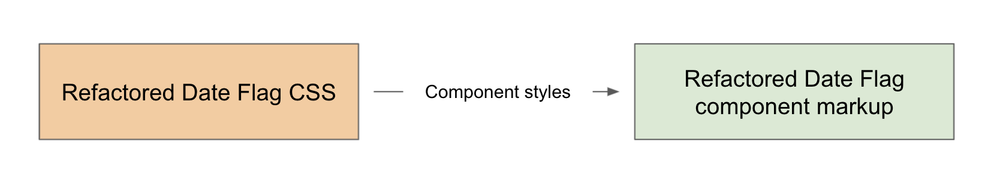
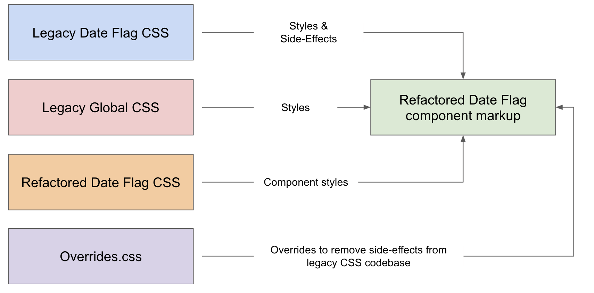
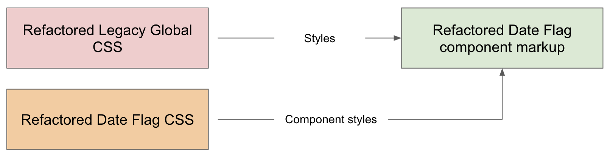

# Strategy

To avoid conflicts with the legacy class names and to separate the refactored code from the legacy code more clearly, we’ll use an `rf-` prefix on CSS class name selectors. Also overrides.css file will be created to add anything we need to override in the legacy CSS files. We also recommend updating a section of the override.css to include all the hacks we needed to do to get the refactored component to work. 

### STEP 1: PICK A COMPONENT AND DEVELOP IT IN ISOLATION

### STEP 2: MERGE WITH THE LEGACY CODEBASE AND FIX BUGS

Make sure to add useful comments in the `overrides.css` file so other team members are on the same page and instantly know why the override has been applied and in response to which selector.

### STEP 3: TEST, MERGE AND REPEAT

Visual regression testing can be treated as the last line of defense before merging the individual pull requests. Now rinse and repeat these three steps until the codebase has been refactored and `overrides.css` is empty and can be safely removed.

### STEP 4: MOVING FROM COMPONENTS TO GLOBAL STYLES

When the codebase has been completely refactored and we’ve removed all makeshift TODO items from the `overrides.css` file, we can safely remove it and we are left with the refactored and improved CSS codebase.

### TASK MANAGEMENT IN GITHUB

1. Create a new git branch for each task
2. With your first commit Create a PR\(Pull Requests\) for each branch
3. Point the PR from your branch to an integration branch

#### Branch naming convention 

`legacy-css__first-name]--[abbr. issue name]__issue[#number]` 

 `legacy-css__carolyn--sticky-submenu__issue571`

