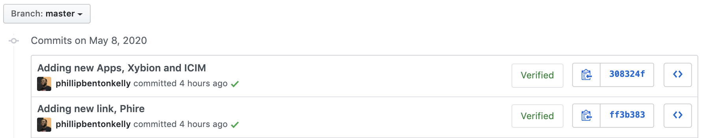

# Self-Service

We created this [repository](https://github.com/CityOfBoston/access-boston-config) in Github to manage changes to the Access-Boston dashboard by editing the config files for each of the environments runs on. The following are the are steps needed to commit changes, this repository will then automatically notify the digital team that a new deploy to AWS is ready to be kicked off.

**Edit Process**

1. From the repository landing page, edit the config file for the environment \(dev/test/prod\) you want to change, by going from the 'src' and the 'config' folder; the click on the folder for the environment you want to edit.

   

2. Click on the 'apps.yaml' file, from the details view click the 'Edit this File' icon.

   

   

   Adding new links require 3 of the following fields:

   * **title**
   * **url**
   * \***groups**: _Groups is a list of groups of people with access that application. The formatting should follow this style: groups_
   * \***icon**: _Icon is require for links in the 'Apps' section, at the top of the file_

3. When you're done making changes, go to the bottom of the page where it says 'Commit Changes' and provide a name and description for the changes made.

   

4. Leave the "Commit directly to the 'master' branch" radio button checked
5. When you're done, hit the "Commit Changes" button

   

6.  No you can go back to either the [homepage](https://github.com/CityOfBoston/access-boston-config) or [commits page](https://github.com/CityOfBoston/access-boston-config/commits/master) to view this commits progress.

Homepage: 

Commits Page: 

If you see a yellow dot next to the commit, its still being processed, once its done the dot will check to a green check mark if it passed or a red x if it failed.

Passed:

Failed:

Once the build for the commit passes, our build integration with Travis notifies Digital Team will be notified via Slack that we can restart the application on AWS.

