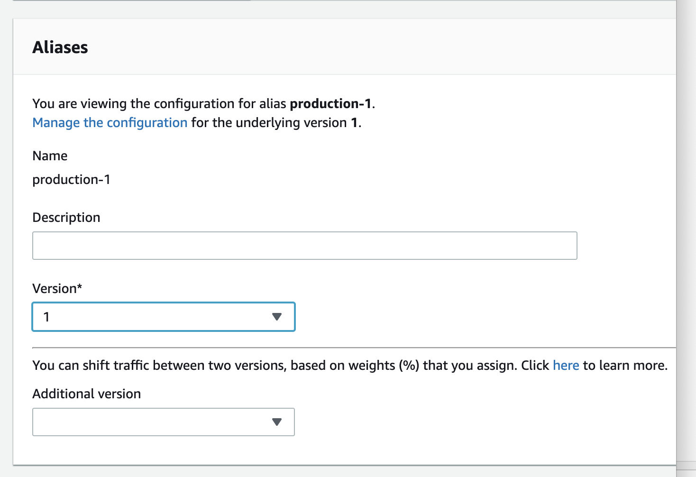

# Alexa Skill

### Deployment

#### Development / beta updates

We have a CodeBuild setup that listens to a particular branch of the [CodeForBoston/voiceapp311](https://github.com/CodeForBoston/voiceapp311) repo. When it receives a change it runs:

* `deploy_tools.py -f` to update the `$LATEST` Lambda function
* `deploy_tools.py -i` to update the interaction model

This causes the latest changes to immediately go live in development and beta uses of the skill.

#### Deploying a New Version of the Skill

When the time comes to release changes to the interaction model, we need to do the following:

1. Publish the current BostonInfoSkill Lambda function as a new version, described with the current date \(e.g. ”2019-05-22”\)
2. Create a new alias pointing to that version
3. In the UI, add “Alexa Skills Kit” as a trigger and paste the Skill ID into the configuration box, then Save
4. Update the Alexa skill’s endpoint ARN to reference the new alias
5. Use the “Test” page to make sure that the lambda is receiving traffic correctly
6. Submit the skill to Amazon for certification \(snapshotting the endpoints\)

After the Amazon verification process completes:

1. Change the Alexa skill’s endpoint back to `$LATEST`

It might be nice to automate this, but we’ll see how often we need to do it. Also, we could use a blue/green strategy for the aliases rather than creating new ones each time.

We don’t keep a single “production” alias because the current production skill needs to keep its same endpoint while we’re waiting for the new version of the skill to pass certification.

#### Updating the Production Lambda

Because we cut releases using Lambda aliases, we can update the code behind the skill without going through a re-certification process, as long as we don’t need to change the interaction model.

This is also a manual process:

1. Have the code built by the development / beta updates CodeBuild so that it becomes current
2. Publish the current Lambda function as a new version
3. Update the current production alias to point to that new version

#### Handling a Failed Verification

Sometimes Amazon will reject the skill. Here’s what to do afterwards, which is a combination of the above steps.

1. Remove the `:production-X` alias from the end of the endpoint in the Alexa skills setting so that the dev skill goes back to pointing at the latest version of the Lambda function built by the CodeBuild process
2. Fix any issues by pushing changes to GitHub and having them be rebuilt

Once you’re sure Amazon will be satisfied:

1. Publish a new version of the Lambda function via the web console
2. Update the previously-used `production-X` lambda alias to point to that new version
3. Update the Alexa Skill endpoint settings to add `:production-X` back in to the ARN
4. Cross fingers
5. Re-submit

#### Further Reading

More information about Alexa deployment strategies: [https://blog.codecentric.de/en/2018/06/non-breaking-lambda-deployments-for-alexa-skills-using-versions-and-aliases/](https://blog.codecentric.de/en/2018/06/non-breaking-lambda-deployments-for-alexa-skills-using-versions-and-aliases/)

### Notes

#### Accounts, Authentication, and Authorization

The Alexa skill belongs to the City of Boston organization within the Amazon Developer console at [https://developer.amazon.com/](https://developer.amazon.com/)

Amazon Developer accounts are in the same namespace as Amazon.com shopping accounts, and are completely separate from AWS and IAM accounts.

Deployment tools authenticate with Amazon using the Login with Amazon \("LWA"\) system. This is based off of OAuth, and provides access and refresh tokens. These tokens allow the tools to act on behalf of accounts.

Applications using OAuth must be registered with LWA and receive a client ID and client secret. The `ask` CLI tool is already registered with Amazon and has an ID and secret baked into it. For for our own tools, we register by creating a "Security Profile" in the Amazon Developer console. You can also specify a client ID and client secret when running `ask` by setting the `ASK_LWA_CLIENT_ID` and `ASK_LWA_CLIENT_SECRET` environment variables, respectively.

To get access and refresh tokens, use `ask util generate-lwa-tokens`. This will prompt for your tool’s client ID and client secret and then open a browser so that you can grant your tool access to your Amazon account for managing your Alexa skills. You can see the authorization if you go to the "Login with Amazon" section of your account on Amazon.com.

Because the access token and refresh token are tied to a particular Amazon account, we created a service account that is in the City of Boston Amazon Developer organization. The deploy tools are configured with a refresh token tied to this account.

#### ask Authentication in CodeBuild

The `ask` tool is typically initialized by running `ask init`, which kicks off an OAuth flow to authenticate with developer.amazon.com also tries to get AWS credentials. It then stores that information in `~/.ask/cli_config`. Because we can’t run `ask init` non-interactively, we configure `ask` using environment variables. These are set in the Terraform configuration for the CodeBuild resource.

* `ASK_LWA_CLIENT_ID` — The client ID for our Login with Amazon security profile
* `ASK_LWA_CLIENT_SECRET` — The secret for our Login with Amazon security profile
* `ASK_VENDOR_ID` — Vendor ID for our City of Boston organization
* `ASK_REFRESH_TOKEN` — A refresh token for our deploy tools service account, authenticating against the above security profile

Additionally, we need to provide `AWS_ACCESS_KEY_ID` and `AWS_SECRET_ACCESS_KEY` environment variables to keep `ask` from trying to look in the non-existent `cli_config` file. Since the `deploy_tools.py` script doesn’t use the `ask` tool to communicate with AWS, we just set these to dummy values.

#### Vendors

Amazon associates a "Vendor ID" with an account organizations. You can see the Vendor ID for City of Boston by running `ask api list-vendors`. 

#### 

