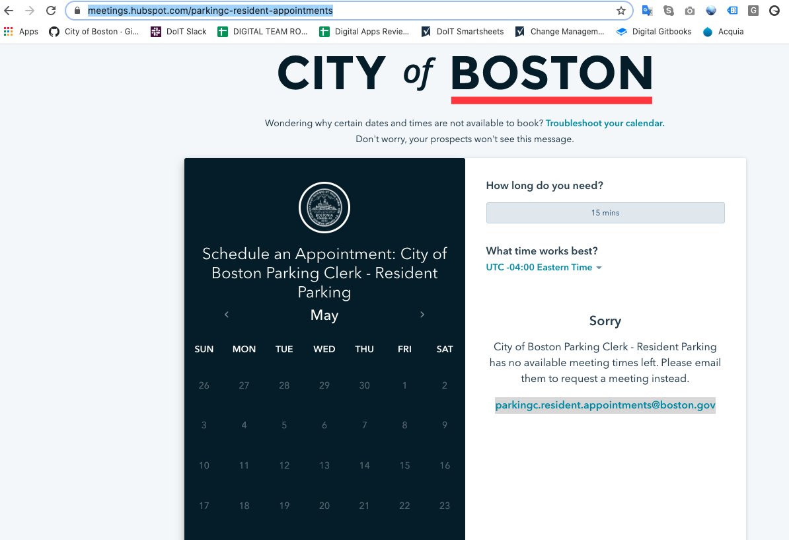

# City Hall Appointment Scheduler

**Reilly actively updating this documentation with ongoing requirements being built out here:** [**https://docs.google.com/spreadsheets/d/1nq47Ox8ubPogYGlob5yYR\_wszvAl-TEl4gkj-Q44Mjo/edit\#gid=9366165**](https://docs.google.com/spreadsheets/d/1nq47Ox8ubPogYGlob5yYR_wszvAl-TEl4gkj-Q44Mjo/edit#gid=9366165)\*\*\*\*

As of June 2020 the following departments needs to be able to offer online scheduling:

* Registry \(some ask for additional features, see bottom\)
* Collecting \(one initial ask for additional features, but not since launch, see bottom\)
* Bid counter for Public Facilities, Parks, and Neighborhood Development Bids \(no ask for additional features\); Parks removed and location and time updated for others on 6/29/20 
* Transportation - Parking Clerk for resident parking, cashiering, and moving permits \(no ask for additional features\)
* Transportation - tow lot \(no ask for additional features\)
* Elections \(no ask for additional features\)
* Assessing \(no ask for additional features\)
* ISD - [Many of their divisions](https://docs.google.com/spreadsheets/d/1yj2P51vIQgdZdBrx8xgRjW2tkxVno0szZ3GON3o8MSI/edit?usp=sharing) \(minimal ask for additional feature, see bottom\)
* DoIT - set up but not yet in use
* City Clerk - decided to stop using 6/15/20

Departments that have a Google service account to manage appointments, but are not using the online scheduler \(because it's so few appointments\):

* ZBA hearings - essentially to schedule room/hearing at City Hall \(see Kelly Mackey or Sarah Figalora for additional information\): ISD ZBA Hearing Appointments \[Kelly created and shared\]
* BTD permitting: btdpermitting@boston.gov 

All meetings are found on unique user profiles at: Log in to Hubspot &gt; Go to Sales &gt; Meetings &gt; Click on a department to edit and/or click add action

Video of what happens/how this works: [https://drive.google.com/open?id=1GeOryUHFz8aqg7iUC5RYHlWwuz2dDwCw](https://drive.google.com/open?id=1GeOryUHFz8aqg7iUC5RYHlWwuz2dDwCw)

How to: Set Up HubSpot Appointment Scheduler at City of Boston: [https://docs.google.com/document/d/1aVDsaxLVwxqAFdlhI5yVMp3EajAfc0\_yFkufbhKw-ZI/edit](https://docs.google.com/document/d/1aVDsaxLVwxqAFdlhI5yVMp3EajAfc0_yFkufbhKw-ZI/edit)

Email script to get people set up: [https://docs.google.com/document/d/1lg033DF3FIGfL7zfgoWkPBjEjmfx51vOj7tlYYPbxOY/edit](https://docs.google.com/document/d/1lg033DF3FIGfL7zfgoWkPBjEjmfx51vOj7tlYYPbxOY/edit)

Email script once people are set up/to get their approval: [https://docs.google.com/document/d/1l7laj6j721Fg9Hhg\_qW-2OtlDqHd5ymG8eOlxp9qzX4/edit](https://docs.google.com/document/d/1l7laj6j721Fg9Hhg_qW-2OtlDqHd5ymG8eOlxp9qzX4/edit)

\[No longer actively being updated, but left here for context.\] A historical tracker for the work can be found here: [https://docs.google.com/spreadsheets/d/1eCRHovix9ah8oGnffURY6GlK-LdiZrRwd3D8n84Ht84/edit\#gid=0](https://docs.google.com/spreadsheets/d/1eCRHovix9ah8oGnffURY6GlK-LdiZrRwd3D8n84Ht84/edit#gid=0)

Things that HubSpot Scheduler cannot do; Reilly reached out to support to see if they were possible and are not. Reilly submitted feature requests to Hubspot. These plus additional features \(listed below\) that Patty, City Clerk, ISD, and OPC expressed in for future iterations of scheduler. Haven't been deal breakers to date, but could be eventually:

1. Ability to remove the below message prompting for people to contact the department for meeting available. We cannot disable this. \(Requested by Registry and OPC-Resident Parking\)

2. Ability for constituent to clarify reason for appointment while scheduling \(departments would ideally like radio buttons/pre-set options to choose from \(Requested by Registry, Collecting \[they only mentioned this upon initial launch, and haven't mentioned again\], City Clerk\)

3. Limited ability for reporting and automation of reporting. \[Idea more from Reilly based on how to best departments.

