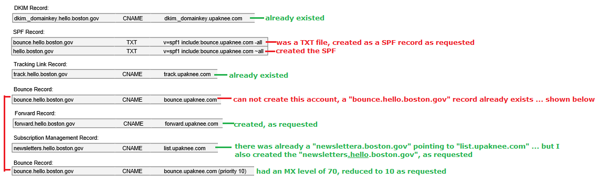

# Upaknee

**4.1 Information:** Admin training recording: [https://drive.google.com/file/d/1XS4TXauQ5leg6vrmQGYMiE1qLho7b9hu/view?usp=sharing](https://drive.google.com/file/d/1XS4TXauQ5leg6vrmQGYMiE1qLho7b9hu/view?usp=sharing)

**Links:**

* Public newsletter subscription center: [https://newsletters.boston.gov/subscribe](https://newsletters.boston.gov/subscribe) &#x20;
* Login link for all employees: [https://boston.upaknee.com](https://boston.upaknee.com) or [https://boston-admin.upaknee.com](https://boston-admin.upaknee.com) &#x20;
* Login link for admins: [https://boston-admin.upaknee.com/](https://boston-admin.upaknee.com) \[There is an overarching admin view. If admins log in to this, they must then go into the 'production' or 'test' environment.
* QA site: [https://boston-qa.upaknee.com](https://boston-qa.upaknee.com) \[same credentials as prod]

**The Different Ways People Can Sign Up for Upaknee**

1. [Newsletters.boston.gov](http://newsletters.boston.gov) (subscription center built and hosted by Upaknee) - for any newsletter - This is hosted by Upaknee.
2. 'Widget' on our [boston.gov](http://boston.gov) website -- this is a custom built Drupal component (system that is PHP/mysql) displayed on our website that is hosted by Acquia. Many City departments have these on their webpages. If you need more you can explore on [boston.gov/departments](http://boston.gov/departments), but I've included a few here:- [https://www.boston.gov/departments/archaeology#updates](https://www.boston.gov/departments/archaeology#updates) > List number 30 [https://www.boston.gov/departments/arts-and-culture#newsletter](https://www.boston.gov/departments/arts-and-culture#newsletter) > List number 13
3. City of Boston open data portal (hosted by opengov): [data.boston.gov](http://data.boston.gov) in the footer connecting to list number 101  These use: [https://contactform.boston.gov/subscriptions?list=LISTNUMBER](https://contactform.boston.gov/subscriptions?list=LISTNUMBER), which is a domain running through our \[City's] AWS instance.
4. One off subscription sites (enabled by Upaknee without City knowledge during summer 2020). All email lists have this, but these aren't actively used (to Digital's knowledge). Example: [https://newsletters.boston.gov/subscribe/index/metrolist](https://newsletters.boston.gov/subscribe/index/metrolist)

These are the **domains** that are set up in DNS Made Easy for Upaknee.

* \[What Upaknee asked of us for domains]\([https://github.com/CityOfBoston/digital-documentation/blob/master/.gitbook/assets/(City of Boston) Full Whitelisting Implementation - DNS Entries.pdf](../../.gitbook/assets/\(City%20of%20Boston\)%20Full%20Whitelisting%20Implementation%20-%20DNS%20Entries.pdf))
* What Frank Skelton was able to do in DNS Made Easy:

**Types of email**\
Emailing from the City can be confusing. It can be called any number of things (Listservs, alerts, newsletter, receipts, etc). Email is the medium, and different kinds of emails can be sent from a number of different source systems.

In general, Upaknee is used for 'marketing' emails. These are emails sent from the City to residents to inform or drive action. These can be editorial, such as newsletters, or automatically generated, like receipts or towing alerts.

Currently, Upaknee only pushes communication. It is not 'transactional' and does not provide receipts or towing alerts. Receipts are processed via Postmark. Towing and street sweeping alerts are processed via Lyris.

The City of Boston Press Office and Boston Public Library both use separate instances of Constant Contact, and do not use Upaknee.

**Best contacts**

* _\*\*_Support@upaknee.com (There is also a [support 'portal'](https://support.upaknee.com/hc/en-us) found via the footer in Upaknee. To see tickets, click on your name in the upper right and click 'my activities'.) &#x20;
  * Historically, City staff have been told they can directly contact Support. This should not be happening moving forward. All communications to Upaknee should go through Reilly, James, Jeanethe, or André. &#x20;
* Sara.Lawrence@upaknee.com - City's account manager &#x20;
* Josh.Ramdhan@upaknee.com - Direct: 1 (416) 304-9818 - operations/project manager

**Active Development**\
Upaknee handles most of the development. They have a standard feature/bug pipeline. We can pay them more to prioritize things, which can be negotiated on a case-by-case basis. Things built using the Upaknee API, like boston.gov email signup forms, are built by our team and live in the boston.gov repo.

**Technology**\
Upaknee is the City of Boston's main email marketing platform. Upaknee replaced Lyris after a competitive bid process in the summer and fall of 2016. [View a copy of the RFP](https://github.com/CityOfBoston/upaknee/blob/master/FINAL%20EV00003360%20Enterprise%20Email%20Marketing%20Solution%20RFP.pdf). Upaknee is currently used for all newsletters.

To add or remove someone from a list, email support (at) upaknee.com. Upaknee is building more optimized list management functionality, but it is still under development, with the new system hopefully rolling out sometime in 2020.

[View the preference center](https://newsletters.boston.gov/subscribe), which has all newsletters the public can sign up for. We also have a number of internal newsletters, like the Digital Digest, that are not available in the subscription center and are only circulated among City staff.

As of 6/19/20, we use Google ReCaptcha V3 to verify good, healthy sign ups: [https://www.google.com/recaptcha/admin/site/430165885](https://www.google.com/recaptcha/admin/site/430165885)

**Historical Strategy**\
The original City of Boston email content strategy (compiled by Joshua Gee) is [outlined here](https://docs.google.com/presentation/d/1rlOybTebsrXAqEhIi5sH2jV4ovZVMDHfGIVKBa-Oewg/edit?usp=sharing). In general, it breaks down into two phases.

* **Phase 1** - Have a modern tool in place that lets departments send beautiful and mobile-optimized emails, track basic stats, and allows users to sign up and manage their preferences. _This is largely done, though we are still waiting on the ability for users to manage their own preferences (Upaknee is creating a new back-end system that will give users more power, but this has not been rolled out to Boston yet)._
* **Phase 2** - Move departments to create more engaging content that more closely aligns with resident needs. Increase the use of list growth best practices. Increase the capacity of the Digital Team the run complicated marketing journeys, send emails with integrated algorithmic content, and run ongoing optimization tests in conjunction with departments. _We are currently training departments and getting new departments onto Upaknee with a good amount of success, with the only real issue being each department's bandwidth to keep the email going following its creation. A lot of emails being sent are in the basic format, though we have tried out A/B testing for the City of Boston list._

As with all strategies, this is subject to change based on new conditions and information.

**Template Info**

* **City of Boston template:** what a majority of emails are sent out using. Recent updates include a social media section where folks can add custom links to their department's social media accounts.
* **Library template:** The Boston Public Library was once going to move to Upaknee, but decided it was not the best fit. When this move was being contemplated, Upaknee created a custom template. It still exists in our Upaknee environment, but it's something we could potentially rework and reuse, we would just need to fix the address in the footer.&#x20;
* **Accessibility Updates:** made in late 2018. Accessibility changes included changing the shade of blue for links and the shade of gray for the footer. [Here's an outline of accessibility recommendations taken into account](https://docs.google.com/document/d/1fGPCm8s59fxaXx1HtASd\_Gn0-YeVIkRNoH2qkesLGSk/edit?usp=sharing).
* _**This is no longer happening as of about February/Marchish 2020:**_ **Metrolist imports; DND now using newsletter component:** Once a week, the Department of Neighborhood Development sends Upaknee Support a list of new subscribers to the Metrolist newsletter. Those subscribers sign up [via a Salesforce widget](https://www.boston.gov/metrolist/subscribe) and need to be exported into Upaknee (into the Metrolist preference) so they can be mailed to. We had been directly importing those subscribers, but that triggered a spam trap in early 2018. We've been running those lists through a reengagement as we try to figure out a better solution.

**Where we could head next (from previous documentation):**\
**1. Welcome series**

Advanced email marketing shoots for a one-to-one experience. We should be moving towards triggered emails that hit the right people at the right time. A good way to experiment with this is with a welcome series. This is a series of emails that someone receives after signing up for our main email list. We have these set up in Upaknee, but we shouldn't launch them until there a plan to test, measure, and improve. [You can read more about the theory and see the approved copy here.](https://docs.google.com/document/d/1ZQs\_oOiS8yZvEQ2EobJjJ4DtxLjUo5TffLuP4FjFy54/edit?usp=sharing)

**2. Revamping transactional emails**

We have a [number of different systems](https://github.com/CityOfBoston/upaknee/wiki/Other-City-of-Boston-tools-that-send-email) that send email notifications. A Harvard Business School student and Digital Team fellow did [initial research about this](https://docs.google.com/document/d/1s\_0HxfDgR-LcNyUmvMpEIlYYhep0pVSC-PuI\_HrNyk8/edit?usp=sharing) in Winter 2017. Figuring out how we can unify the look and feel of emails, and potentially send them all out of the same system, would be a good future fellow project. Eventually, the goal would be a single place where customers can manage all of their emails, alerts, and notifications from the City.

_**3. No longer a thing - was decommissioned in February/Marchish 2020 -**_ **Upaknee widget for Salesforce:** Several parts of the city use Salesforce as a database (Metrolist being the largest example). If we co-develop a Salesforce Appexchange Upaknee widget, it will mean departments can use Salesforce as they system of record, but send through Upaknee. It will also mean we no longer have to do manual reconciliation. The Department of Neighborhood Development has put in for budget to do this. We could build direct connects more quickly and easily, but syncing two databases is a nightmare.

**Other Clients of Upaknee/Examples of Other Subscription Centers Built by Upaknee**

[Washington Post](https://subscribe.washingtonpost.com/newsletters/#/newsletters)

[A subscription center they had helped build](https://www.screencast.com/t/xqABpFv97T) \[unknown for whom]\

Other historical documentation: [https://drive.google.com/drive/u/0/folders/1213C312i3IXNWkyO41Cm\_89KQe-L26kM](https://drive.google.com/drive/u/0/folders/1213C312i3IXNWkyO41Cm\_89KQe-L26kM)
