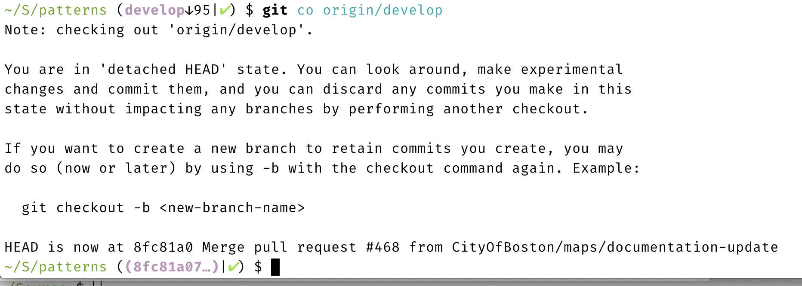
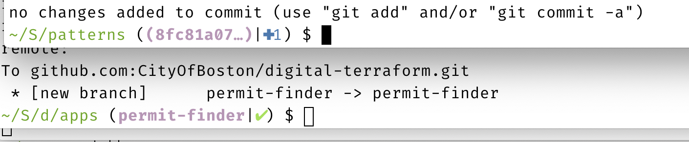

# Git Command Tips

## Git Strategy

Git has a reputation for being complicated, and part of that is because the problem that it addresses — distributed version control — is a complicated problem.

Here’s a \(hopefully\) short way of thinking about Git that might help you avoid getting your repo in a messy state, or at least guide you out of it when it happens.

### Commits

To be successful with Git, it’s important to understand its model: starting from nothing, a series of patches, called “commits,” that, over time, build up a repository.

Commits each have an identifier, known as a “SHA” because they’re generated by taking a SHA hash of the commit’s data. Canonically they’re a 40-character hex number, but are usually referred to by the first 8 characters because those are probably unique in the repo.

Sometimes these commits follow one after another. Each has a single parent and modifies the repo in some way, like steps in a LEGO instruction book.

Other times, commits “merge” the changes from two different “parent” commits together back into one, like two roommates coming back together after the holidays. If the commits changed different parts of the repository — say, everyone got new clothes for their own closets — this merge happens easily and automatically. But, if they both brought posters that they wanted to hang in the same place in the common room, that’s a conflict that needs to be resolved.

Part of good shared Git repository use is communicating with your teammates and merging small changes frequently. The longer you spend collecting bric-a-brac on your own, the more likely it is your roommate has moved the shelf you were planning on using when you got back. And, if you have a large change planned, like refactoring a lot of code, it’s best to tell your co-workers not to pick out curtains until after the metaphoric common room has been repainted.

In concrete terms:

* Regularly update your local repo with the latest version of the code by using `git fetch` or `git pull` and merge / rebase those changes into your in-development branch.
* Keep your changes focused when you can, adding single features or modifying just a few files at a time.
* When a necessary change is large, let your pals know what parts of the code base you have designs on so they can avoid making their own changes in those areas until you’re done.

This will minimize the number of conflicting changes, which will reduce the number of times your Git repo gets in a rough state.

### Branches

A lot of attention when using Git is focused just on branches, but it’s helpful to think of  them in terms of commits, since that’s how Git does.

A branch is nothing more / less than a name that is referring to a particular commit. What makes them particularly useful \(and distinct from Git tags\) is that they can be changed to point to a different commit.

It’s worth underlining that the history of changes that lead from nothing to a code base is kept not in the branches, but in the commits. The `develop` branch just _points_ to a particular commit and it is that commit — not the `develop` branch — that is a diff against one or more parent commits, all the way back to 0.

In order to be convenient and useful, the `git` tool will update branches — pointing them at different commits — automatically. But a key to understanding Git is to distinguish between what role the commit has vs. the role the branch has.

For example, `git commit` is used to make a new commit. It takes all the staged changes in your working directory and a commit message, and makes a new commit with your directory’s current `HEAD` commit as its parent. It then considers the new commit the current `HEAD` of the directory.

This works even when you’re not using branches, what Git refers to as “detached HEAD state.” You can still create commits. You’ll need to use their SHAs to reference them, but they’re still there.



Now, if your repo is currently checked out to a branch \(because you did `git checkout my-branch`\), the above description of `git commit` all still applies. The `git` tool just does the _added_ behavior of updating the name `my-branch` to point to the new `HEAD` commit you just made.

Once you think in these terms, Git commands like `reset` make a little more sense. `reset` takes the current branch and points it at a different commit.

So, to undo a `git commit`, you can run `git reset HEAD^` \(`HEAD` is a special name for “what’s checked out now” and `^` means “the commit before”\). `reset` by default does not change the files on disk, so you didn’t lose any work. But, since you’ve changed what `my-branch` is pointing at, the changes that were previously committed now appear as uncommitted. \(If you check your terminal history and find the SHA from the commit, you could run `git reset <SHA>` to re-do the commit by pointing the branch back to it.\)

An important caveat: commits that are not either pointed to directly by a branch or in the branch commit’s ancestry are eligible to be garbage-collected by Git. They tend to last in your local repository for about 30 days, and can be referred to by their SHA during that time.

## Useful Tips

### Shell Prompt

Make sure your shell prompt is Git-aware. It should show you what branch you’re on and ideally if there are uncommitted changes in your directory.



### Editor

Use an editor that is Git-aware, in particular one that shows you diffs \(preferably side-by-side\) and lets you edit in the diff. This is invaluable for seeing your work and doing pre-push editing passes on the code before putting it up as a PR.

Visual Studio Code is very good at this, with the caveat that if you diff staged changes against the latest commit you can’t edit them with the diff tool. You can edit unstaged changes, however. You can `git reset HEAD` to unstage everything if you need to, or `git reset HEAD^` to un-commit your previous commit \(while preserving its changes in your working directory\).

### Aliases

You can add “aliases” to your `~/.gitconfig` file that mean you don’t have to type as much on the command line.

```text
[alias]
	co = checkout
	st = status
	amend = commit --amend --no-edit
    delete-merged = "!git branch --merged | grep  -v '\\*\\|master\\|develop' | xargs -n 1 git branch -d"

```

These make `git co` short for `git checkout` and `git st` short for `git status`.

`git amend` is useful for adding the currently staged changes to the previous commit. This is very useful in development to pre-squash your commit and avoid a chain of “tmp” commits in your history. \(Use `git commit --amend` if you want to add to the previous commit but edit the commit message.\)

`git delete-merged` is a cute little housecleaning command that removes all local branches that point at commits that are parents of the current branch. So if you do: `git fetch` `git co origin/develop` `git delete-merged` it will remove any local branch that you’ve already merged into `develop`, keeping the output of `git branch` cleaner.

## Recipes

### Starting a new change

If you’re working on a new feature or bug fix, you’ll want to make a particular branch for it so it can be code-reviewed as a PR. \(See our [GitHub working agreement](./) for proper behavior.\) Since you’re intending to merge it back into the `develop` branch, it’s best to start by branching off of `develop`. But, not just anywhere, but the _latest_ version of `develop` that your coworkers / roommates have committed.

```text
$ git fetch
$ git checkout origin/develop
$ git checkout -b my-new-branch-name
```

This first uses `fetch` to update our local cache of the default `origin` remote \(_i.e._ the GitHub repository\) to the absolute latest. It then checks out the commit that `origin`’s `develop` branch is pointing to in “detached HEAD” state. Finally it creates a new branch with your new name. \(You can use `git co` if you’ve put in the aliases from above.\)

Following this recipe will ensure that you’re starting new work from the absolute latest that has been checked in to GitHub and will keep you from accidentally committing things to a local `develop` branch and getting mixed up.

### Context-switching

Sometimes you’re working on one thing in your working directory but then realize that you need to put it aside and make a quick bug fix or something.

While Git provides a “stash” feature for saving things, it can be easy to lose or forget about the contents of your stash. Better to make a new commit.

#### Saving your work

```text
$ git add -A
$ git commit -m tmp
```

This adds all changes, including new files and deleted files, to the index and then commits them all with a “tmp” commit message.

Then, follow the above “starting a new change” recipe to get yourself set up for the fix you need to make.

#### Restarting your work

```text
$ git checkout my-previous-branch
$ git reset HEAD^
```

Use this recipe to get back to what you were working on, with a `git reset HEAD^` to get rid of the “tmp” commit while still preserving the changes from it in your working directory.

### Updating your branch with the latest

It’s a good habit to make sure your branch is based on the latest changes from the branch you’ll be merging into \(probably `develop`\). You also sometimes _need_ to do this if your change is going to rely on something that got merged after you started working on it \(often because of the above context switch\).

#### Fingers-crossed method

```text
$ git fetch
$ git rebase origin/develop
```

This method updates our cache of `origin` as before, and then runs `git rebase`. Rebasing is a powerful capability of Git that can also get you into a mess of trouble. The first thing `rebase` does is the equivalent of a `reset --hard` to make both your current branch and the contents of your working directory match `origin/develop`. It then re-commits every change from where your branch and `origin/develop` diverged. \(The equivalent of repeated `git cherry-pick`.\)

If your changes are in conflict with ones from the latest version of `develop`, you’ll have to follow the instructions to resolve those.

In general, `rebase` is preferred because it leaves your Git history nice and linear and clean. It’s as if someone time-travelled back to when you were first working on the feature and gave you a different place to start from.

But, there are caveats that can blow up in your face, which is why we call it the “fingers-crossed” method. `git` is going to apply your commits individually, and in order. If any of them have conflicts with the new updates, resolving them can be tricky. For example, say you have commits “tmp”, “tmp 2”, and “fixed” that all change the same code. Say it took you a few tries to get a bit of code right. Remember that commits are diffs against their parent, so “tmp 2” knows how to apply changes against “tmp”, and likewise “fixed” expects the part of the repo that it affects to look like “tmp 2”.

If you rebase and there’s a conflict when applying “tmp” you’ll need to resolve it before `git rebase` can proceed. It can be tempting, since you’re now editing the code, to make things look like how they ended up with “fixed”, but that’s not what you need to do. You need to resolve things so that “tmp 2” can be applied correctly.

This is one reason why you should **squash your changes as you develop**. Rather than make “tmp 2” and then “fixed”, use `git commit --amend` to re-do the “tmp” commit. There’s no value in preserving those intermediate broken states forever in your repo’s history, after all. Rebasing just one commit is always going to go a lot more smoothly than multiple commits, since you don’t have to worry about correcting things to those intermediate states.

If you end up in a bad, confusing place, just type `git rebase --abort` to cancel the rebase operation and try again with the “merge/reset” method below.

#### Merge/reset method

If `git rebase` gave you trouble and you also don’t mind squashing your commits and re-writing the commit message, you can use this method.

```text
$ git fetch
$ git merge origin/develop
$ git reset origin/develop
$ git add -A
$ git commit
```

This starts with the easy-to-forget `git fetch` to get us up-to-date. It then _merges_ the latest from the `develop` branch into our current branch. Unlike `rebase`, `merge` does _not_ rewrite history and re-apply your commits. This means that when you resolve conflicts you only need to do it between the latest versions of the `develop` branch and your own. You don’t have to do the intermediate state stuff that made `rebase` painful.

When used in this way, however, `git merge` will typically leave behind a “merge commit” that points to the two parents \(whatever commits `origin/develop` and your branch were on when it was run\) and contains any diff necessary to resolve conflicts. This is an untidy artifact.

To excise the merge commit from our branch’s history so that it’s neat, we do a `git reset origin/develop` to point our branch to `develop`’s latest commit. Since `reset` without `--hard` doesn’t change the working directory at all, all of our changes, including the conflict resolutions from the `git merge` , are all still there. `git add -A` followed by `git commit` bundles them all up and commits them.

### Extracting changes for review

This is a combination of “Context switching” and “Updating to the latest.” The scenario is that you’re knee-deep in work on a branch when you realize that part of what you’re doing is distinct enough that it belongs in its own PR. Two small PRs is kinder and safer than one big PR.

You should start this by following “updating to the latest” so that your branch is up-to-date with `develop`.

```bash
$ git reset origin/develop
$ git add …
$ git commit
$ git add -A
$ git commit -m tmp
$ git co <sha>
$ git co -b <my-new-branch>
$ git push
```

Ready?

This starts with a `git reset` so that all of the changes we’ve been working on are out-in-the-open as uncommitted. \(This is why making sure we’re up-to-date with `origin/develop` is so important before starting.\)

Then, use `git add <filename>` to selectively add changes in that you want to put up for review now. If some files have changes where you only want some of the changes you can often use your editor or `git add -p` to stage just what you need.

Once that’s done, do a `git commit` and use a proper commit message to describe these changes. Keep note of the SHA of this new commit. You’ll need it.

Next we add everything else and commit it, which you might recognize from the context-switching recipe. It's relevant as well that this commit has your intermediate commit as its parent. That means that your future changes will probably merge cleanly after the intermediate commit is merged.

`git co <sha>` with the SHA of the intermediate commit will check it out as a detached HEAD. This removes any of the later changes from the working directory, where they could mess up pre-push tests and such. Then it‘s a `git co -b` to give these changes a name and `git push` to send them up.

#### Dealing with intermediate changes changing

Sometimes, either because pre-push tests fail or because you got PR feedback to make changes, the version of your extracted change that got committed is different from the one your later work is based on.

This can be especially tricky if you were tidy and squashed your changes, since the repo now has two slightly different commits that make essentially the same changes. And “slightly” is more than enough to give them different SHAs, which makes them completely different to Git.

You might have some luck with the “merge/reset” method of updating after the extracted changes get merged to `origin/develop`, but you can often rebase you way out of it as well.

```bash
$ git fetch
$ git log
$ git rebase HEAD^ --onto origin/develop
```

After the standard `git fetch`, use `git log` to see how many commits you’ve made since extracting the other PR. If you haven’t done anything since, or have been using `--amend` to squash changes, there will only be one. If there are more, you’ll need a `^` after `HEAD` for each change.

This use of `rebase` takes all changes since `HEAD^` \(meaning: the commit before the current one\) and replays them on to `origin/develop`. Depending on whether or not the test/PR fixes you made intersect with your later work, this will be either annoying to resolve or automatic.

### Being defensive

#### Preparing for disaster

Anything you’ve committed locally is saved in your local repository for 30 days, even if no branches are referring to it.

Before you do anything risky to your repo, it can be good to just run a `git add -A` / `git commit -m tmp` to get it stored. You can then note down the SHA of that commit or even run `git branch saved-branch-name` to checkpoint it with a more permanent name, before running `git reset HEAD^` to undo the commit.

#### Recovering from disaster

If you’ve been committing fairly regularly, you can typically always get yourself back to a good state. If you lost a SHA or need to otherwise undo, you can run `git reflog` to print out a history of all of the commit/checkout–type changes you’ve made in your repository. That can often help you find a place you want to get back to.

`git reset --hard <sha>` is a useful tool to get your branch and working directory to a specific commit, particularly after a merge or rebase goes south, and you can try again.

## Matters of Opinion

* “Squash” your branches down to a single commit before pushing them up for review. The local checkpoints you made along the way to finishing your feature are not relevant for the future.
* It’s ok to force-push. Doing a `git push --force` has historically been super-dangerous because Git would update all branches on the remote repo to what they look like locally, destroying other folks’ work. This has given it a bad reputation. But, force pushing can be useful for keeping the commit history clean, such as when implementing changes from a PR. The rule of thumb is: _don’t force-push branches that other people are using._ That gets messy because you’re rewriting history on someone and they have to take special actions to accommodate you. But typically you shouldn’t be working from other people’s branches. Get them committed to develop!
* Give your main branch a better name than “master.” It’s a word that has not-great connotations while also being wholly undescriptive. Is your main branch where development work happens? Call it “develop”. Does it automatically reflect production? Call it “production”.
* Don’t use a your local branch called `develop`. In fact, run `git branch -D develop` to delete it. It’s too easy to start working from `develop` without realizing that it’s long out-of-date relative to GitHub, or to make commits on your local `develop` branch that you then can’t find anymore. Use `git fetch` and `git checkout origin/develop` to get your working directory to the latest from GitHub.


